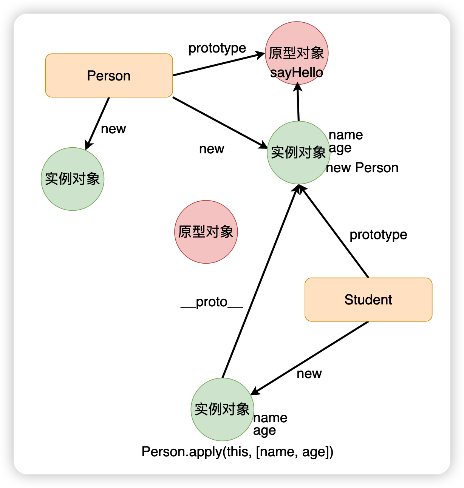
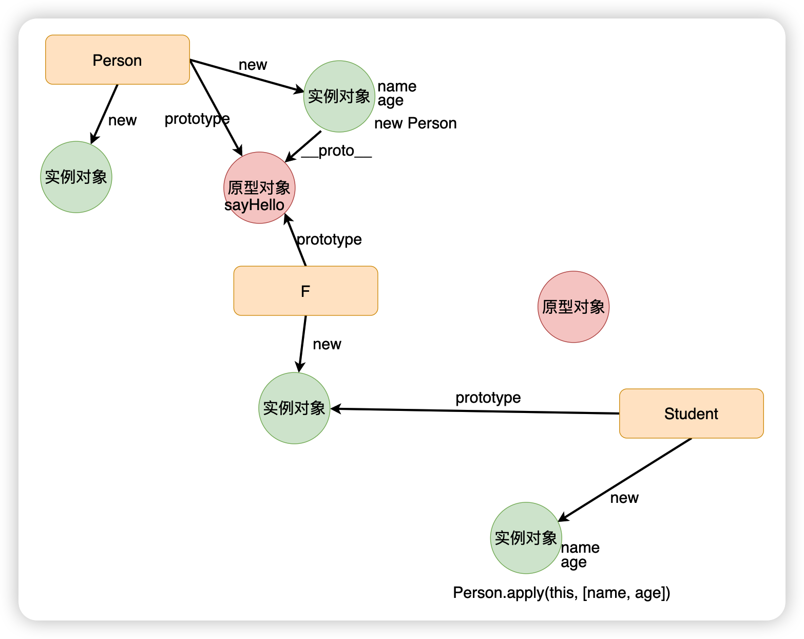

# 继承

## 概述

+ 在 OOP 中，继承是一种允许新创建的类（称为子类或派生类）继承另一个类（称为父类或基类）的属性和方法的机制
+ 通过继承，子类自动包含了父类的所有属性和方法（除了私有成员），使得开发者可以在这个已有的基础上构建更复杂或特定用途的功能

## JavaScript中的继承之组合模式

+ 早期的时候，JavaScript 中的继承的写法五花八门，其中有一种最为熟知的模式，称之为组合模式实现继承：

  ```js
  function Person(name, age){
    this.name = name;
    this.age = age;
  }
  Person.prototype.sayHello = function(){ ... }

  // 子类
  function Student(name, age, gender, score){
    Person.apply(this, [name, age]);
    this.gender = gender;
    this.score = score;
  }
  Student.prototype = new Person();
  ```

+ 但是这种组合模式会有一个问题：

  

+ 但是上面的这种结构，当我们执行到 `Person.apply(this, [name, age]);` 这一行代码，会执行到 Person 函数内部的 `this.name = name` 以及 `this.age = age` ，这里的 this 指定的是 Student 的实例对象，所以在 Student 实例对象上面，会有一份 name 和 age 属性

+ 之后，在执行 `Student.prototype = new Person();` 这行代码的时候，会实例化一个 Person 实例对象，这个 Person 的实例对象上面又会有一份 name 和 age，导致了属性会多一份，Student 实例对象上面会有一份，Student 原型对象上面也会有一份

  

+ 正因为组合模式有这样的问题，所以它从经典模式跌落成了伪经典模式。

+ 后面就出现了圣杯模式来解决这个问题，

## JavaScript中的继承之 圣杯模式

+ 圣杯模式的核心就是拿一个空的构造函数去当中间人，从而解决组合模式的问题

  ```js
  // target: 子类---> Student
  // original: 父类 ---> Person
  function inherit(target, original){
    function F(){} // 一个空的构造函数
    F.prototype = original.prototype; // 让 F 的原型对象指向父类的原型对象
    target.prototype = new F();
    // 修正一下 constructor
    target.prototype.constructor = target;
  }

  // 父类
  function Person(name, age){
    this.name = name;
    this.age = age;
  }
  Person.prototype.sayHello = function(){ ... }

  // 子类
  function Student(name, age, gender, score){
    Person.apply(this, [name, age]);
    this.gender = gender;
    this.score = score;
  }

  inherit(Student, Person);
  ```

+ 圣杯模式的原型链指向图：

  

## ES6 中实现继承

+ ES6 中实现继承 `extends`

  ```js
  class Person {
    constructor(name, age){
      this.name = name;
      this.age = age;
    }
    sayHello(){}
  }

  class Student extends Person{
    constructor(name, age, gender, score){
      super(name, age);
      this.gender = gender;
      this.score = score;
    }
  }
  ```

## TypeScript中的继承

+ 和 ES6 是一样的，通过 `extends` 来实现继承

  ```js
  class Person {
    private _name: string;
    private _age: number;

    constructor(name: string, age: number) {
      this._name = name;
      this._age = age;
    }

    sayHello() {
      console.log(
        `Hello, my name is ${this._name} and I am ${this._age} years old`
      );
    }

    get name() {
      return this._name;
    }
  }

  class Student extends Person {
    private _gender: string;
    private _score: number;

    constructor(name: string, age: number, gender: string, score: number) {
      super(name, age);
      this._gender = gender;
      this._score = score;
    }

    sayScore() {
      console.log(`My score is ${this._score}`);
    }
  }

  const zhangsan = new Student("张三", 18, "男", 100);
  zhangsan.sayHello();
  zhangsan.sayScore();
  console.log(zhangsan.name);
  ```
