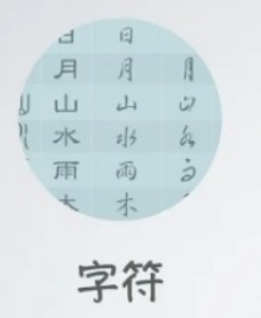
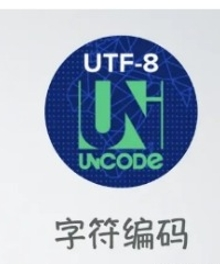

# 字符、字符集、字符编码

## 字符

+ 字符是一种抽象的概念，可以是一个字母、数字、标点符号、汉字、一个表情、一个图像或者你随手写画的任务图案
+ 在过去字符可能被刻在石头、甲壳、竹筒、宣纸上，抽象的字符背后代表着人们的具象的理解
+ 而在计算机中显然不能将一个字符直接拿去存储，计算机的底层只能存储二进制，我们需要将字符转成二进制存储到计算机中

  

## 字符集

+ 一堆字符的集合就是字符集
+ 例如有 GB2312字符集 中文字符集（一堆汉字组成的）、英文字符集（一堆英文字母组成的）
+ 字符集就像是一个密码本，存储着字符与某种规律集合的映射

  

## 字符编码

+ 人类世界中有大量的字符，为了让计算机认识这些字符，我们需要把字符转成计算机能识别的二进制，再用二进制对着字符集将字符渲染到屏幕，这个将字符转为计算机能识别的二进制规则，就叫做“字符编码”

  

## 字符集编码

+ 首先我们选定一批要编码的字符（比如英文26个大小写字母），然后我们将这批字符排成一个有顺序的集合（字符集），此时从0开始字符集中每个字符都会有一个因为编号，我们将再将这个编号转成二进制存入计算机中
+ 在计算机中编号和在屏幕上要渲染的视觉效果形成映射，计算机就可以通过二进制将字符串存储下来，在不同的设备之间也能通过二进制作为数据的传输，只要他们有相同的字符集、编码方式和硬件渲染的效果

## 编码过程

+ 计算机需要以 0 1 二进制存储
+ 计算机存储的基本单位是字节， 1字节=8位二进制，每一位二进制可能是0或1，那么8个二进制揪有 2^8 种情况，也就是256种状态，那么一个字节最多能映射256中字符

+ 比如A在一个字符集中排序65位，转成二进制就是1000001，因此我们将1000001存入计算机中

  