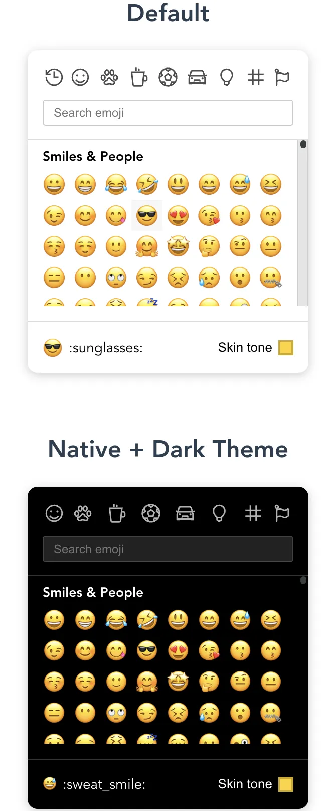

# Emoji 选择器

## 概述

+ Emoji 选择器可帮助用户方便地插入 Emoji 字符。它在许多应用（如聊天软件、社交平台、文本编辑器等）中广泛使用。我们可以根据需要自定义 Emoji 选择器（可以借助 emojibase 库的数据来实现），也可以使用开源的 Emoji 选择器，以下是一些比较热门的 Emoji 选择器（npm包名称）

  + emoji-mart

    

  + emoji-picker-react

    

  + vue3-emoji-picker

    
