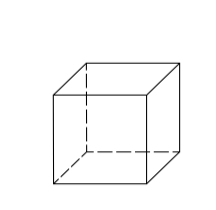

# 正方体

## 定义

+ 用六个完全相同的正方形围成的立体图形叫正六面体，也称立方体、正方体

  

## 表面积

+ 因为正六面体6个面全部相等，且均为正方形，所以正六面体的表面积
+ 其中，a为正六面体的棱长，S为正六面体的表面积

  ```
  S=6a²
  ```

## 体积

+ 个正方体的棱长为a，则它的体积

  ```
  V = a * a * a = a³
  ```
