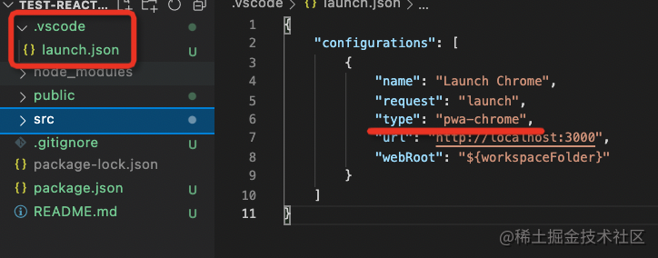
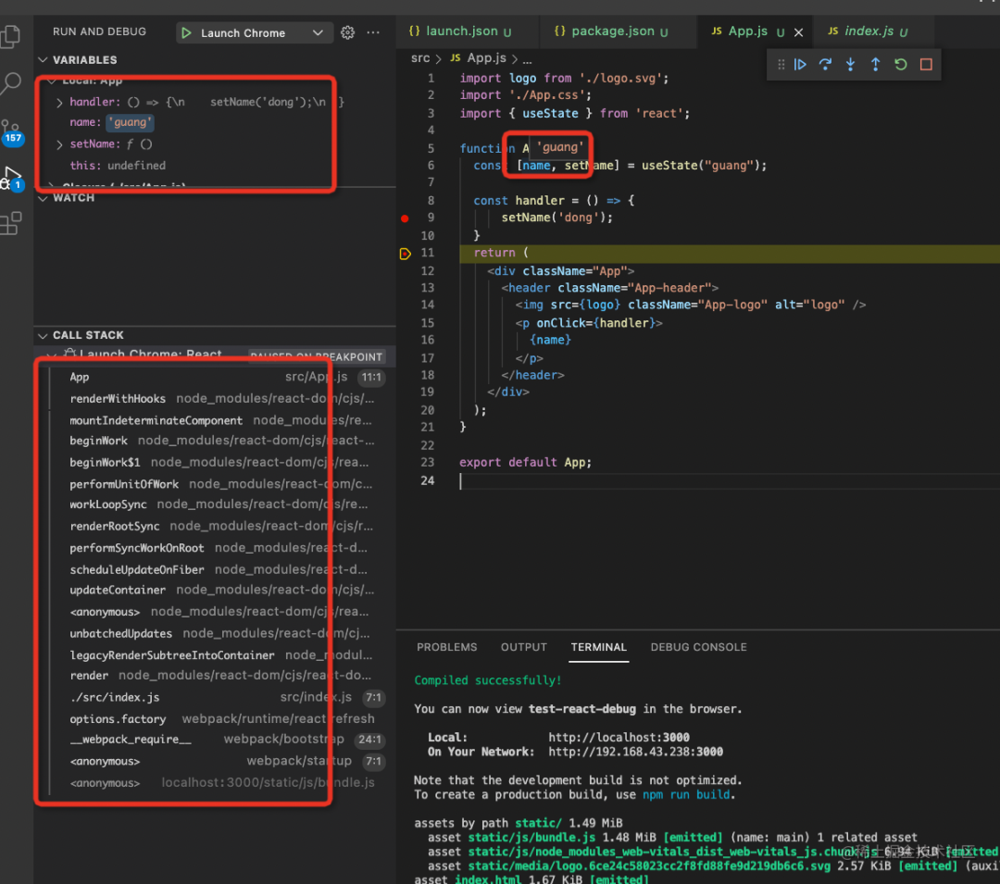

# 调试框架

## 调试VUE

  - 方式1

    <https://cn.vuejs.org/v2/cookbook/debugging-in-vscode.html>

## 调试TS

  - 使用 `TS-node` `npm install -D ts-node`

  - 开启 sourceMap

    ```json
    {
      "sourceMap": true,
      "outDir": "./out"
    }
    ```

  - 配置

    ```json
    {
      // 使用 IntelliSense 了解相关属性。
      // 悬停以查看现有属性的描述。
      // 欲了解更多信息，请访问: https://go.microsoft.com/fwlink/?linkid=830387
      "version": "0.2.0",
      "configurations": [
        {
          "type": "node",
          "request": "launch",
          "name": "Launch Program",
          "runtimeArgs": [
            "-r",
            "ts-node/register"
          ],
          "args": [
            "${workspaceFolder}/src/index.ts"
          ]
        }
      ]
    }
    ```

## 调试React

1.  根目录下添加一个 .vscode/launch.json 的配置文件

    

2.  创建了一个调试配置，类型是 chrome，并指定调试的 url 是开发服务器的地址。

3.  打断点

    

4.  运行

    

5.  效果

    

6.  查看事件对象

    

## 查看React源码

  - 直接点击调用栈里的某一帧看就行

    

## 调试Node

  - 步骤

    

## 调试vue

  + Ctrl+ Shift + p，进入debug open link
  
    
