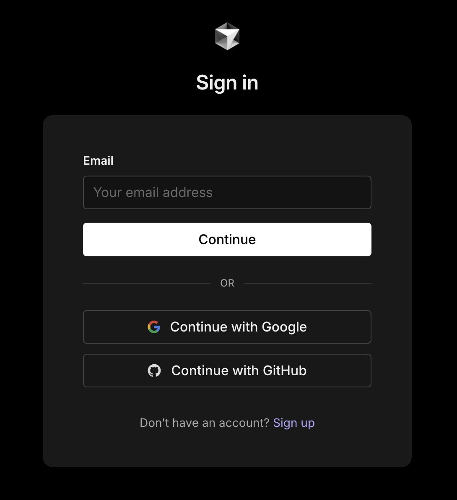
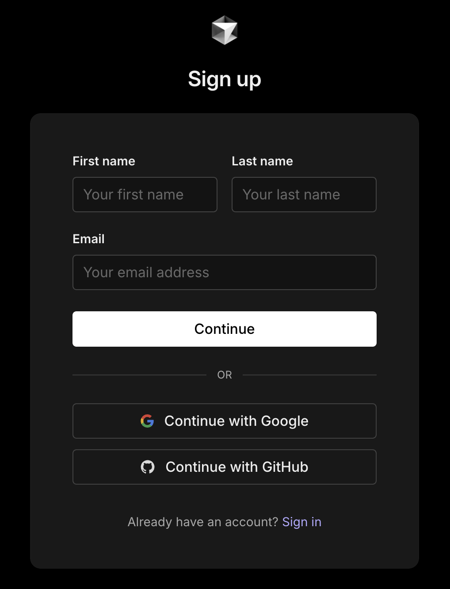
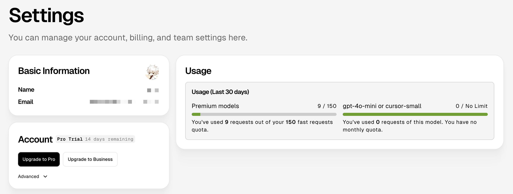
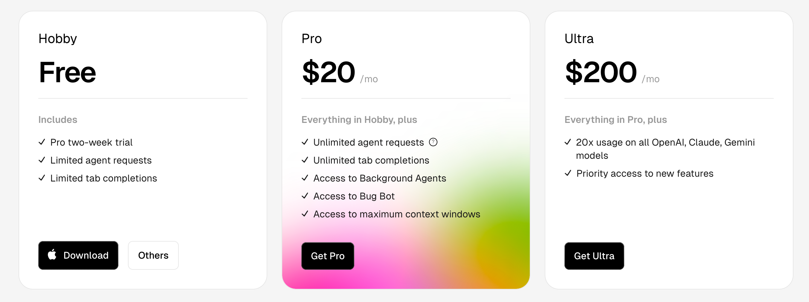

# 基本介绍

## 概述

+ Cursor 是一款**基于 VS Code** 打造的 AI 编程增强编辑器，它集成了 GPT-4、Claude 等主流大模型，具备强大的 **代码自动补全、对话生成、智能重构** 等能力
+ 无论你是初学者还是经验丰富的开发者，Cursor 都能成为你得力的“编程助手”

## Cursor 特点

+ 对新手友好：不懂代码也能通过描述需求，让 AI 帮你构建基本的项目骨架，快速搭建 MVP

  + MVP：Minimun Viable Product（最小可行产品：demo）

+ 对开发者高效：支持 Chat、Prompt 模板、函数解释、重构建议等，帮助你提升开发效率

+ 支持 AI 驱动协作开发：结合“结对编程”理念，Cursor 可以成为你随时在线、逻辑清晰、不知疲倦的搭档

  + Pair Programming（结对编程）：关键的核心模块、新人培训、复杂的问题的 Debug

## 安装Cursor

+ 访问 [Cursor 的官网](https://www.cursor.com/)，然后注册 Cursor 的账号

+ 点击 Sign in 按钮进行登录，可以选择从 Google 或者 Github 进行登录

  

+ 也可以选择 Sign up 进行注册，邮箱可以用国内邮箱，比如 QQ 邮箱，163 邮箱，126 邮箱等

  

+ 成功登录之后，会自动跳转到 Cursor 的个人设置页面，该页面会展示你的账号信息以及额度信息。新用户默认会有一些体验额度，可以免费使用 15 天（体验 Pro 版本）

  

+ Cursor 版本更新还是比较频繁的，此前 Cursor 会自动升级到最新版本，但有时新版本不太稳定，会遇到一些问题，也有的用户更习惯使用旧版本的体验， Github 上有个开源的[仓库](https://github.com/oslook/cursor-ai-downloads)，维护了 0.36.2 版本之后所有 Cursor 的历史版本

## Cursor收费计划

+ Cursor 提供了 3 种不同的订阅计划，可以选择按月付费或者按年付费（年付可节省20%）

  

## Hobby 版本（免费）

+ 完全免费使用，包含以下功能：

+ Pro 两周试用
+ Agent 请求受限
+ Tab 补全受限

## Pro 版本（$20/月）

+ 包含 Hobby 版本所有功能，另外还有：

+ 无限 Agent 请求
+ 无限 Tab 补全
+ 访问后台 Agent
+ 访问 Bug Bot
+ 访问最大上下文窗口

## Ultra 版本（$200/用户/月）

+ 包含 Pro 版本所有功能，另外还有：

+ 在所有 OpenAI、Claude、Gemini 模型上拥有 20 倍的使用额度
+ 更高的并发请求数
+ 更大的上下文长度或响应 token 限额
+ 更快的响应速度
+ 更少的排队等待时间

+ 优先使用新功能
