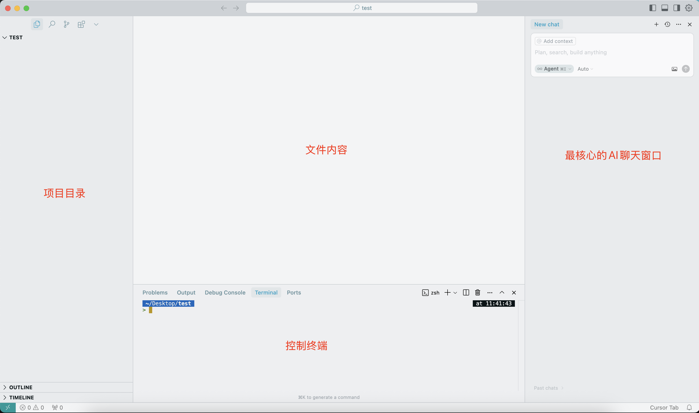

# 功能介绍

## Cursor主界面

+ Cursor 在结构布局上与 VSCode 十分类似，但它增加了面向 AI 编程的核心区域

  

+ 左侧：资源管理区（Explorer）

+ 中间：主编辑区域

+ 下方：终端（Terminal）

+ 右侧：AI 聊天面板（Chat Assistant）

  + New chat区域：可直接发起 AI 对话
  + `@ Add context`：绑定当前文件上下文（代码自动传入对话）
  + 输入框：支持提问、代码生成、bug 解释等自然语言操作
  + `Agent` 下拉：选择对话模式

+ 底部状态栏右下角：Cursor Tab 与模型状态

  + 显示当前是否连接到 AI 服务、当前模型类型

  + 如果网络或模型切换，通常会在这里提示

## 左侧菜单

+ **General**：通用设置
+ **Chat**：配置 AI 对话相关设置（例如上下文保留、模型选择）
+ **Tab**：可能与多标签页或工作区配置相关
+ **Models**：选择和配置使用的模型（如 GPT-4、Claude、Gemini 等）
+ **Background Agents**：管理运行中的智能 Agent（NEW，可能是 Cursor 最新引入的功能）
+ **Tools & Integrations**：集成 Git、终端、测试框架等工具
+ **Rules / Indexing & Docs / Network / Beta / Docs**：其他开发者相关设置和文档入口

### 左侧菜单 之 General 通用设置

+ Manage Account

  + 功能：打开账户管理页面（通常跳转到官网管理后台）
  + 可配置内容包括：**订阅套餐、账单信息、更换信用卡、取消订阅等**

+ Editor Settings

  + 功能：配置编辑器的行为和界面
  + 支持的配置内容包括：

    + 字体（字体类型、大小、行高）
    + 主题（明亮 / 黑暗）
    + 自动格式化、自动补全
    + 显示 minimap（小地图）、行号、折叠标记
    + Tab 缩进大小、空格 vs Tab
    + 光标样式等

+ Keyboard Shortcuts

  + 功能：配置键盘快捷键
  + 打开命令面板：`Cmd/Ctrl + Shift + P`
  + 输入并选择：Preferences: Open Keyboard Shortcuts (JSON)

+ Import Settings from VS Code

  + 功能：将 VS Code 的设置、扩展、快捷键等导入 Cursor
  + 适合 VS Code 老用户快速迁移到 Cursor 环境

+ Reset “Don’t Ask Again” Dialogs

  + 功能：重置你之前选中“不再提示”的对话框
  + 用于恢复提醒（比如保存前提示、执行高危命令的确认框等）

## 隐私设置 Data Sharing Enabled

+ 功能：控制是否将你的代码、提示词、编辑行为等匿名数据分享给 Cursor 用于产品改进
+ 当前状态为「开启」
+ 可点击「Share Data」按钮切换为关闭状态
