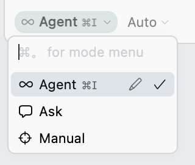
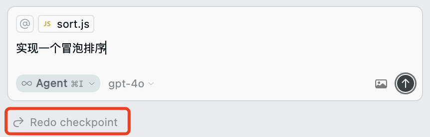

# 对话驱动开发

## 概述

+ 测试驱动开发
+ 行为驱动开发
+ 领域驱动开发
+ 事件驱动开发
+ .....

+ AI 的出现使其出现了新的开发模式：对话驱动开发

  + PDD（Prompt-Driven Development）：提示词驱动开发
  + AI-DD（AI-Driven Development）：AI 驱动开发

## 区别

+ 两者区别如下表：

  | 维度             | PDD（Prompt-Driven）                       | AI-DD（AI-Driven）                                            |
  | ---------------- | ------------------------------------------ | ------------------------------------------------------------- |
  | **驱动方式**     | 开发者写 prompt，AI 根据提示生成代码       | AI 根据上下文、环境、目标主动参与编程                         |
  | **控制权**       | **开发者强控制**：AI 是工具                | **控制权部分转移给 AI：AI 是合作者**                          |
  | **主要手段**     | 编写清晰、高质量 prompt 是核心能力         | 构建 AI 协作环境（如持续对话、自动分析）是重点                |
  | **输出范围**     | 局部代码生成（函数、接口、配置）           | 全局参与（项目结构建议、模块拆分、重构建议）                  |
  | **依赖模型能力** | 通常是调用 GPT、Claude 等接口              | 可能集成多个模型 + 插件 + 工具链                              |
  | **典型工具**     | Copilot Chat、Cursor Prompt Block、CodeGPT | Cursor Max Mode、Code Interpreter、AutoDev 工具链、GPT Agents |

+ PDD举例说明

  >帮我写一个注册的接口，带邮箱和密码的验证。

+ AIDD举例说明

  >该项目是否有可以优化的地方。

+ 在 Cursor 中，提供了几种不同的对话模式：

  

  + Ask：PDD驱动
  + Agent：AI 驱动

## Chat窗口回滚和撤销

+ 在 Chat 窗口中，右下角有一个 Restore 按钮，可以回滚到之前的版本

  

+ 在回滚之后，还可以使用撤销按钮，撤销回滚

  
