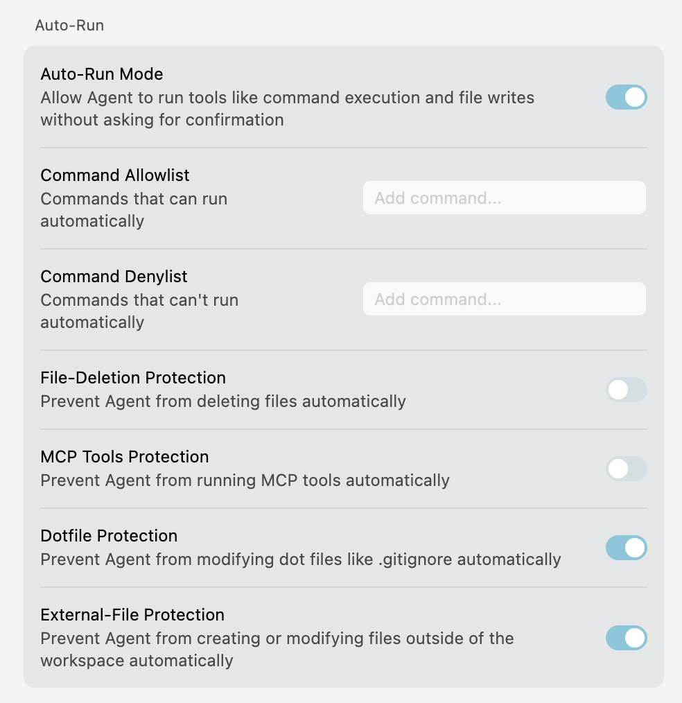

# Auto-Run模式

## Auto-Run模式

+ 早期的 Agent 模式， 会根据你的提示，判断是否需要执行命令，如果需要执行命令，会提示你确认

+ 之后 Cursor 推出了 Auto-Run 模式，则是更往前走了一步
+ Agent 将无需确认就能执行命令和文件操作，朝着"全自动驾驶"又迈进了一步
+ 开启 Auto-run 模式后，Cursor 编辑器能够：

  + 文件的增删改查控制权利更大
  + 执行代码所需的命令
  + 修复可能出现的问题
  + 重复执行这些操作，直到达成最终的目标

   

| 选项                         | 功能解释                                             | 建议设置                         |
| ---------------------------- | ---------------------------------------------------- | -------------------------------- |
| **Auto-Run Mode**            | 是否启用自动执行（包括命令行、文件写入、MCP 工具等） | 建议仅在可信项目中开启           |
| **Command Allowlist**        | 指定允许自动执行的命令（如 `npm install`、`echo`）   | 安全可控，推荐配合 Auto-Run 使用 |
| **Command Denylist**         | 指定禁止自动执行的命令（如 `rm -rf`、`shutdown`）    | 强烈建议设置，防误操作           |
| **File-Deletion Protection** | 防止 Agent 自动删除文件                              | 默认关闭，建议开发时打开以防误删 |
| **MCP Tools Protection**     | 禁止自动运行 MCP 工具（如依赖审计、代码分析）        | 若担心工具链副作用可开启         |
| **Dotfile Protection**       | 防止自动修改 dot 文件（如 `.gitignore`, `.env`）     | 默认开启，避免污染配置           |
| **External-File Protection** | 防止 Agent 自动创建或改动工作目录之外的文件          | 默认开启，防止越权访问外部文件   |

## 实战案例

+ 请帮我创建一个新的 React 项目，包含一个计数器组件，要求：

  1. 使用 Vite 创建项目
  2. 创建一个 Counter 组件，包含增加和减少按钮
  3. 添加一些基本的样式
  4. 运行项目并确保一切正常

## 自动生成提交信息

+ Cursor 提供 AI 生成提交消息功能，让我们不再需要花费大量时间思考如何描述代码变更。

**如何使用**

1. 完成代码修改后，打开源代码管理面板
2. 在提交消息输入框中，点击右侧的闪光图标 (✨)，AI 会自动生成提交消息

+ 上图中的 commit 信息是 AI 自动生成的

## 工作原理

+ Cursor 的 AI 提交消息生成器通过分析以下内容工作：

  + 修改的文件
  + 具体的代码变更
  + 提交的上下文
  + 仓库的 Git 历史记录

+ 生成过程包括三个主要步骤：

   1. 分析已暂存（staged）的文件变更
   2. **学习你的提交历史模式**
   3. 结合上下文生成合适的提交消息

**最佳实践**

1. 检查生成的消息

2. 控制提交大小

3. 遵循常见的提交格式（目前普遍使用的是 Angular commit 规范）

   - feat: 新功能

   - fix: 修复问题

   - docs: 文档更新

   - style: 代码格式调整

   - refactor: 代码重构

   - test: 测试相关

   - chore: 构建过程或辅助工具的变动

