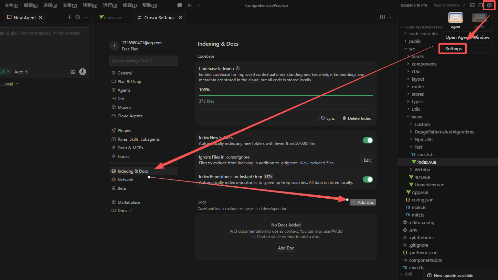
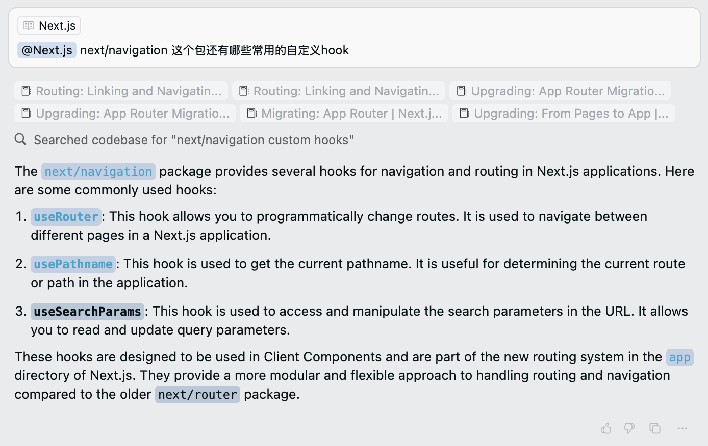

# Docs

## 概述

+ 获取官方文档或者第三方文档信息

+ 例如，我们要写一个 Next.js 项目，需要参考 Next.js 的官方文档，我们可以将官方文档添加到 Cursor 中，然后通过@Docs命令访问

+ Cursor 会自动抓取和索引第三方文档，你还可以通过 `Cursor 设置` -> `Features` -> `@Docs` -> `Add new doc` 添加自定义文档

  ```
  添加文档首页

  例如  Element Plus
  https://element-plus.org/zh-CN/component/overview
  ```

  

+ 我们在 Chat 窗口输入框中输入 `@Docs` 和需要提问的问题，然后按`Enter`键，就可以访问文档了

  
