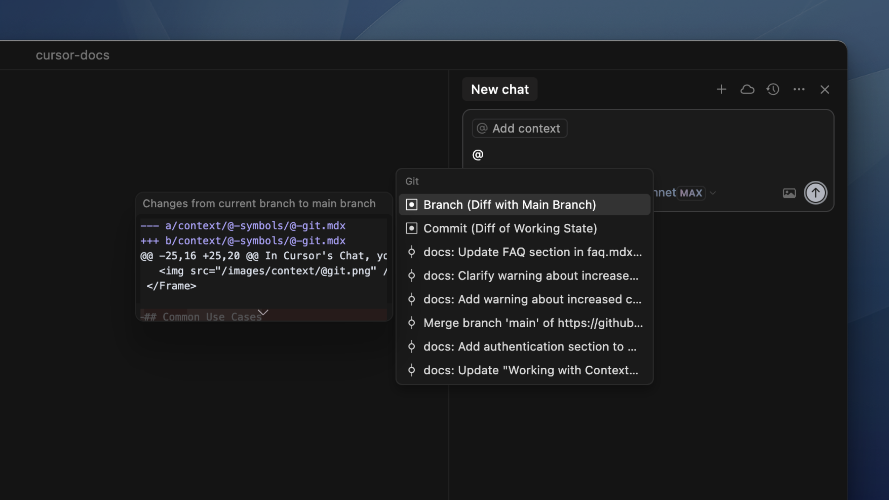

# Git

## 概述

+ 在 Cursor 中，可以使用 `@Git` 相关的特殊指令来分析当前项目的 Git 变更情况、比较分支内容、以及查看未提交的文件状态
+ 这些符号让 AI 可以更好地理解当前代码的变化上下文

  

## @Commit：引用当前工作状态的改动**

+ 使用 `@Commit`，你可以让 AI 告诉你 **当前工作区** 与 **最近一次提交（HEAD）** 之间的“未提交变更”

+ 包括 **新增的文件**、**修改过的文件** 和 **已删除的文件**

  > [!note]
  >
  > 例如：你在当前项目中修改了 `login.js` 和 `auth.js`，尚未提交，现在想知道这两处的改动有没有问题。你可以对 AI 说：请帮我检查一下 @Commit 中的改动有没有潜在的问题，比如逻辑错误或代码风格不统一。
  >
  > AI 会读取尚未提交的变更，并反馈比如：
  >
  > - “`auth.js` 中的错误处理逻辑存在重复”
  > - “`login.js` 的登录判断条件可能导致空密码通过验证”

## @Branch：对比当前分支与主分支的差异

+ 使用 `@Branch`，可以查看当前分支与主分支（如 `main`）之间的差异：

+ 显示当前分支新增的提交

+ 展示与主分支不同的代码变更

  > [!note]
  >
  > 例如：你在一个 `feature/signup-flow` 分支上开发了注册流程，准备合并回 `main`，但不确定有哪些重要更改。你可以对 AI 说：请帮我总结一下 @Branch 中相对于 main 分支的所有功能改动，方便我写 PR 描述。
  >
  > AI 会列出当前分支比 main 多出的提交与变更，比如：
  >
  > - “新增了 `SignupForm.vue` 组件”
  > - “修改了 API 调用逻辑”
  > - “引入了新的依赖（如 `yup` 用于表单验证）”

