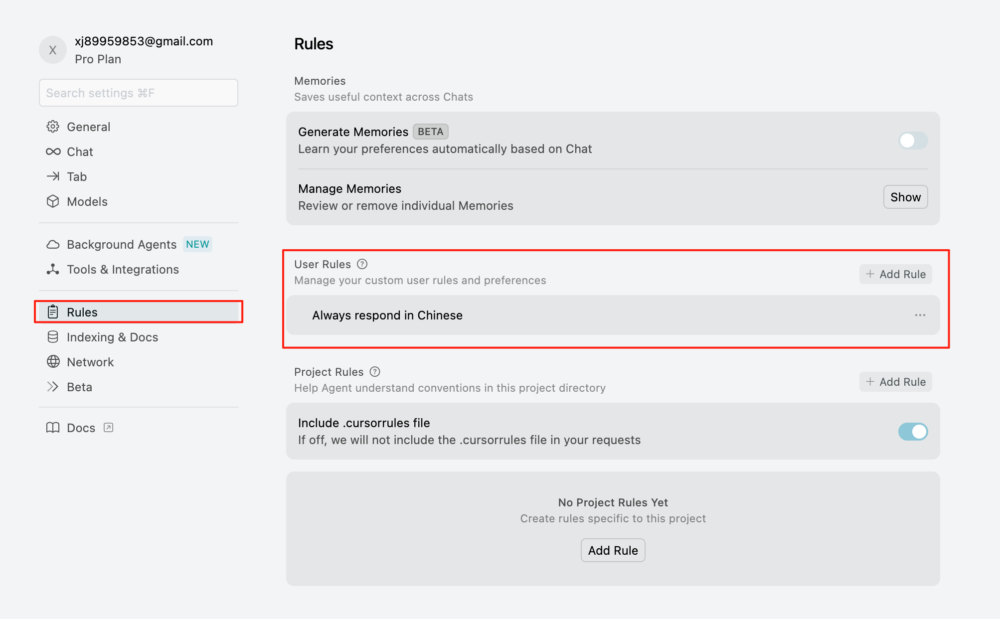
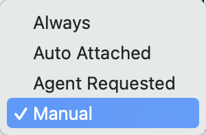
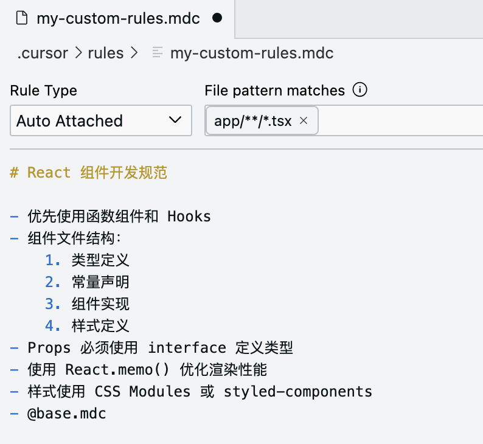

# Rules

## 概述

+ 规则是 Cursor 的一个功能
+ 你可以用它来控制 AI 的行为
+ 这些规则会在每次对话时自动使用
+ 这样 AI 就能按照你想要的方式工作
+ Rules 本质上就是属于提示词工程的一部分

## 主要用途有

+ 设定编码风格
+ 定制文档格式
+ 统一团队流程
+ 个性化代码审查

## 设置的方式有三种：

1. 全局规则
2. 项目规则
3. 规则文件（废弃了，因为兼容性目前还存在，但是未来有可能完全被移除）

## 全局规则

+ 全局规则对所有项目都有效

  

## 项目规则

+ 顾名思义就是每个项目一份，项目之间不会共享

+ 在项目根目录的 `.cursor/rules` 文件夹中创建 `.mdc` 文件
+ mdc 是 Cursor 的 Rules 文件的专有格式
+ 它基于 Markdown 格式
+ 这意味着你直接使用最熟悉的 Markdown 语法来写就完事儿了

+ 它支持四种规则类型:

  1. Always：自动附加到所有聊天和命令请求（command + k），适用于全局规则
  2. Auto Attached：基于文件模式匹配自动触发，例如: .tsx, .json, Test.cpp
  3. Agent Requested：针对特定任务场景，需要提供任务描述。帮助 AI Agent 更好地理解和执行特定任务
  4. Manual：需要手动提及才会被包含，适用于特殊场景的临时规则

  

+ 支持的功能：

  + 规则内容：**用 Markdown 格式**写规则
  + 规则引用：用 @file 引用其他规则文件

  

## 规则文件

+ **为了兼容性**，旧版使用的 `.cursorrules` 文件，目前仍被支持，但 Cursor 官方文档明确提到 `.cursorrules` 文件将来会移除。

+ 建议迁移到新系统，迁移步骤如下：

  1. 将现有规则按功能拆分为多个文件
  2. 在 `.cursor/rules` 目录创建对应规则
  3. 在 Globs 字段指定适用范围
  4. 通过 @file 引用保持规则链式调用

  

## 使用案例

+ `.cursor/rules/base.mdc` 写入如下规则：

  ```md
  # 项目基础开发规范

  ## 基础开发规则
  - 使用 ESLint 和 Prettier 进行代码格式化
  - 文件命名采用 kebab-case
  - 导入语句按类型分组并排序
  - 避免魔法数字，使用常量定义
  - 函数长度不超过 50 行

  ## 项目目录结构

  ├── .cursor/
  │   └── rules/
  │       ├── base.mdc           # 基础规则
  │       ├── react.mdc          # React 相关规则
  │       ├── typescript.mdc     # TypeScript 规则
  │       ├── testing.mdc        # 测试规则
  │       └── docs.mdc           # 文档规则
  └── src/
      ├── components/
      ├── features/
      └── tests/
  ```

+ React 组件的开发规范，位于 `.cursor/rules/react.mdc`

  ```markdown
  Description:
  React 组件开发规范，确保组件的可维护性和性能

  Globs:
  src/components/**/*.tsx, src/features/**/*.tsx

  # React 组件开发规范
  - 优先使用函数组件和 Hooks
  - 组件文件结构：
    1. 类型定义
    2. 常量声明
    3. 组件实现
    4. 样式定义
  - Props 必须使用 interface 定义类型
  - 使用 React.memo() 优化渲染性能
  - 样式使用 CSS Modules 或 styled-components
  - @base.mdc
  ```

+ TypeScript 规则，位于 `.cursor/rules/typescript.mdc`

  ```markdown
  Description:
  TypeScript 开发规范，确保类型安全和代码质量

  Globs:
  **/*.ts, **/*.tsx

  # TypeScript 规则
  - 禁用 any 类型，使用 unknown 替代
  - 启用 strict 模式
  - 使用类型推导减少冗余类型声明
  - 公共函数必须包含 JSDoc 注释
  - 使用 type 而不是 interface（除了 Props）
  ```

+ 测试规则，位于 `.cursor/rules/test.mdc`

  ```markdown
  Description:
  单元测试和集成测试规范

  Globs:
  src/**/*.test.ts, src/**/*.test.tsx

  # 测试规则
  - 使用 React Testing Library
  - 测试文件与源文件同目录
  - 测试用例结构：
    1. 准备测试数据
    2. 执行被测试代码
    3. 断言结果
  - Mock 外部依赖使用 MSW
  - 测试覆盖率要求：
    * 语句覆盖率 > 80%
    * 分支覆盖率 > 70%
    * 函数覆盖率 > 90%
  ```

+ 最后是文档规则，位于 `.cursor/rules/doc.mdc`

  ```markdown
  Description:
  项目文档编写规范

  Globs:
  **/*.md

  # 文档规则
  - 使用中文编写
  - 包含以下部分：
    1. 功能说明
    2. 使用示例
    3. API 文档
    4. 注意事项
  - 代码块标注语言类型
  - 配置说明使用表格格式
  - 重要信息使用引用块标注
  ```

