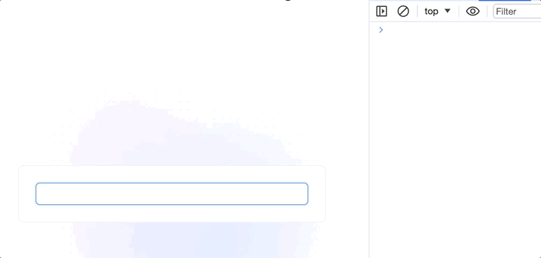

# 不监听输入法拼音

## 原生 input 事件

+ 代码

  ```js
  const input = document.getElementById("input");
  input.oninput = e => {
    // 模拟请求
    console.log("发起请求", e.target.value)
  }
  ```

  

+ 防抖解决不了：防抖是减少触发频率的，而最终该触发啥还是得触发啥事件

## Vue的@input事件

+ vue 中输入法输入拼音时不触发 `@input` 事件

  ```html
  <input @input="handleChange" />

  <script>
    const handleChange = (e:any) => {
      console.log(e.target.value)
    }
  </script>
  ```

+ 可以看到 `@input` 事件跟原生的 `input` 事件不同，`@input` 在输入拼音的时候并不会触发，而是最后得出输入法结果时才会去触发

  

## vue 的解决办法

+ 在输入需要合成的字符串时，会触发这两个回调函数
+ 而我们输入法输入拼音时就是属于输入合成字符串的情况

  + compositionstart 事件
  + compositionend 事件

  ```js
  const input = document.getElementById("input");

  let isComposition = false; // 记录当前是否属于输入合成字符串期间
  el.addEventListener("compositionstart", () =>{
    isComposition = true;
    console.log("合成开始")
  });

  el.addEventListener("compositionend", () =>{
    console.log("合成结束")
    isComposition = false;
  });

  input.oninput = e => {
    // 属于合成字符串期间就不执行
    if(isComposition) { return }

    // 模拟请求
    console.log("发起请求", e.target.value)
  }


  ```
