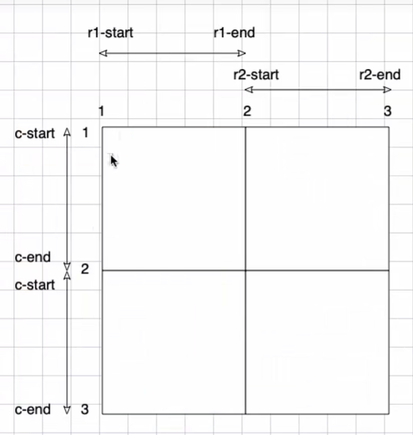
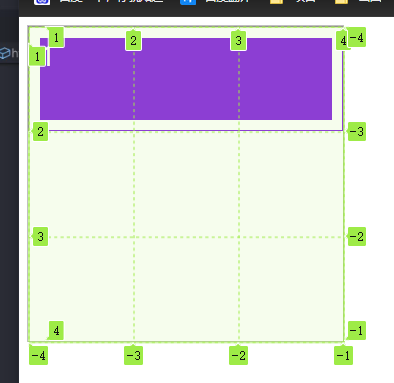
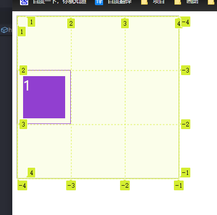

# 栅格编号放置位置

## 网格线

+ 划分网格的线，称为"网格线"（grid line）
+ 水平网格线划分出 **行**
+ 垂直网格线划分出 **列**

+ 正常情况下，`n` 行有 `n + 1` 根水平网格线，`m` 列有 `m + 1` 根垂直网格线，比如三行就有四根水平网格线

  

## 示例

+ 示例1

  ```html
  <article>
    <div>1</div>
  </article>
  ```

  ```css
  article {
    width: 300px;
    height: 300px;
    border: 1px solid silver;
    display: grid;

    /* 行高 最大100px 最小50px */
    grid-template-rows: repeat(3, 1fr);
    grid-template-columns: repeat(3, 1fr);
  }
  div {
    background-color: blueviolet;
    background-clip: content-box;
    border: 1px solid blueviolet;
    padding: 10px;
    box-sizing: border-box;
    color: white;
    font-size: 25px;
  }

  div:first-child {
    grid-row-start: 1; /* 行开始 */
    grid-row-end: 2; /* 行结束 */
    grid-column-start: 1; /* 列开始 */
    grid-column-end:4; /* 列结束 */
  }
  ```

  

+ 示例2

  ```html
  <article>
    <div>1</div>
  </article>
  ```

  ```css
  article {
    width: 300px;
    height: 300px;
    border: 1px solid silver;
    display: grid;

    /* 行高 最大100px 最小50px */
    grid-template-rows: repeat(3, 1fr);
    grid-template-columns: repeat(3, 1fr);
  }
  div {
    background-color: blueviolet;
    background-clip: content-box;
    border: 1px solid blueviolet;
    padding: 10px;
    box-sizing: border-box;
    color: white;
    font-size: 25px;
  }

  div:first-child {
    grid-row-start: 2;
    grid-row-end: 3;
    grid-column-start: 1;
    grid-column-end: 2;
  }
  ```

  
