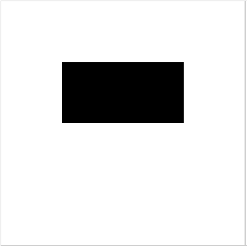

# 绘制矩形

## 概述

+ 可以绘制两种矩形， 有三种方式

  + 填充的矩形(实心矩形)
  + 描边的矩形(空心矩形)

## ctx.fillRect 绘制填充矩形

+ `ctx.fillRect(x , y , width ,height)`

  ```js
  const ctx = canvas.getContext('2d');
  ctx.fillRect(100,100,200,100);
  ```

  

## ctx.strokeRect  绘制描边矩形

+ `ctx.strokeRect(x , y , width , height)`

  ```js
  const ctx = canvas.getContext('2d');
  ctx.strokeRect(100,100,200,100);
  ```

  
