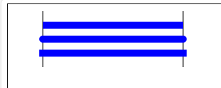

# 设置线条样式 Line styles

## lineWidth 设置线条宽度

+ 设置当前绘线的 *粗细*
+ 属性值必须为正数
+ 默认值是 1.0

## lineCap 线条末端样式

+ 设置线条末端样式(连接点、线帽)

+ `lineCap = type`

  + `butt` 平的 （*默认*，没有任何额外的效果）
  + `round` 圆的 （端点处增加了半圆，视觉效果直线变长了）
  + `square` 平的 （端点处增加了矩形，视觉效果上直线变长了）

  

  ```js
  ctx.lineCap = "round";
  ```

## lineJoin = type

+ 设定折线连接处的样式

+ `lineJoin = type`

  + miter 尖的 *默认*
  + round 圆的
  + bevel 平的

  ```js
  ctx.lineJoin = "miter"
  ```

## miterLimit = value

+ 限制当两条线相交时交接处最大长度；所谓交接处长度（斜接长度）是指线条交接处内角顶点到外角顶点的长度

## getLineDash()

+ 返回一个包含当前虚线样式，长度为非负偶数的数组

## setLineDash(segments)

+ 设置当前虚线样式

## lineDashOffset = value

+ 设置虚线样式的起始偏移量
