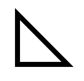

# 线条闭合

## closePath

+ 如果需要首尾节点闭合，可以使用 `closePath()`

  

  ```js
  ctx.lineWidth = 10;
  ctx.moveTo(100,100);
  ctx.lineTo(100,200);
  ctx.lineTo(200,200);
  ctx.closePath();
  ctx.stroke();
  ```

+ 未使用 `closePath` ，会存在缺口的情况

  

  ```js
  ctx.lineWidth = 10;
  ctx.moveTo(100,100);
  ctx.lineTo(100,200);
  ctx.lineTo(200,200);
  ctx.lineTo(100,100);
  ctx.stroke();
  ```
