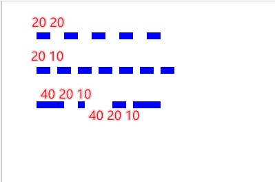

# 虚线

## 概述

+ `ctx.setLineDash( array )`

  + array中可以放置多个数值
  + 分别表示线段的 长度 和 线段 间留白的长度

+ `array = [10]`  线段长度 和 留白的长度都是 10

+ `array = [20,10]` 线段的长度(20) 和 留白的长度(10)分别设置

+ `array = [10,20,30]`   按照数组的数列，无限的延续下去(线段10  留白20 线段30 留白10 线段20 留白30 线段10 留白20  ....)

  

  ```js
  // 线段长度 和 留白的长度都是 20
  ctx.setLineDash([20]);

  // 线段的长度(20) 和 留白的长度(10)分别设置
  ctx.setLineDash([20,10]);

  ctx.setLineDash([40,20,10]);
  ```

## getLineDash()

+ 返回一个包含当前虚线样式，长度为非负偶数的数组

## lineDashOffset = value

+ 设置虚线样式的起始偏移量

+ 正数值: 向左偏移
+ 负数值: 向右偏移

  

  ```js
  // 向右偏移 20
  ctx.lineDashOffset = -20;

  // 向左偏移 20
  ctx.lineDashOffset = 20;
  ```

## 示例

+ 线条虚线

  ```js
  ctx.setLineDash([200]);
  ctx.beginPath();
  ctx.moveTo(50,150);
  ctx.lineTo(250,150);
  ctx.stroke();
  ```

+ 矩形虚线

  ```js
  ctx.setLineDash([30]);
  ctx.rect(50, 100, 200, 100);
  ctx.stroke();
  ```
