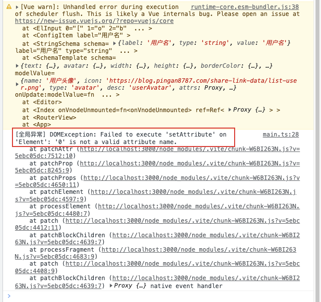

# 开发环境报错排查

## 异常

- Vue3.x 对于一些开发过程中的异常，做了更友好的提示警告，比如下面这个提示

    

## 解决

- 可以添加 Vue3.x 提供的**全局异常处理器**，更清晰的**输出错误内容和调用栈信息，代码如下**：

    ```typescript
    // main.ts
    app.config.errorHandler = (err, vm, info) => {
        console.log('[全局异常]', err, vm, info)
    }
    ```

    
