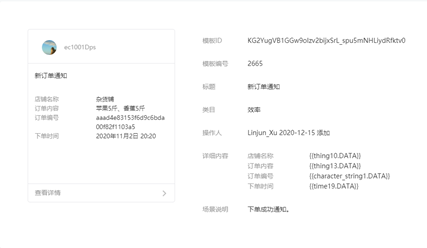
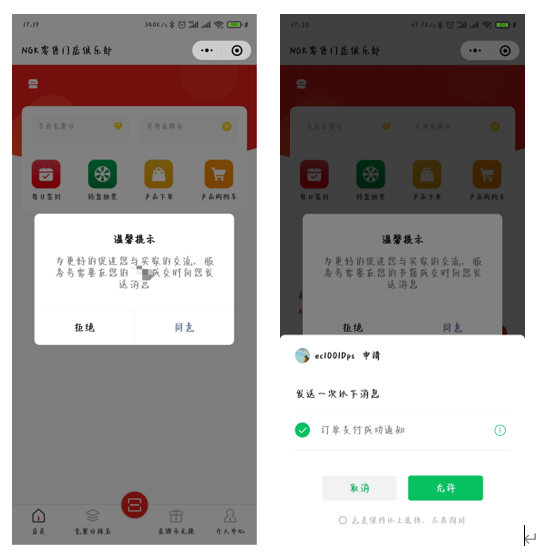

# 订阅消息

## 步骤

1. 可选择已有的模板也可以申请新的模板消息

2. 可选择已有的模板也可以申请新的模板消息

3. 授权后可以接收到相关信息提醒

## 可选择已有的模板也可以申请新的模板消息

- 消息模板&#x20;

    

- 新增页面

    

- 详情页面

    

## 可选择已有的模板也可以申请新的模板消息

- 授权

    

## 授权后可以接收到相关信息提醒

- 授权

    
