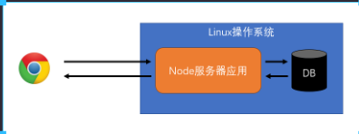

# 介绍

## 官网

> [https://nodejs.org/en/](https://nodejs.org/en/ "https://nodejs.org/en/")

> [http://nodejs.cn/](http://nodejs.cn/ "http://nodejs.cn/")

## 什么是 Node

*   Node是一个JS的运行环境

*   它比浏览器拥有更多的能力

    *   浏览器 JS

    *   ECMAScript + web API

    *   web api 提供了操作浏览器窗口和页面的能力

    *   DOM

    *   BOM

    *   AJAX

    *   这种能力是非常有限的

    *   跨域

    *   文件读写

    *   Node 的JS

    *   ECMAScript + Node API

    *   。。。

## 浏览器 JS 与 Node.JS 对比

*   浏览器提供了有限的能力，JS只能使用浏览器提供的功能做有限的操作

*   Node提供了完整的控制计算机的能力，NodeJS几乎可以通过Node提供的接口，实现对整个操作系统的控制

## 通常用 Node 干什么

*   开发桌面应用程序

*   开发服务器应用程序

## 开发服务器应用程序 -- 结构1

*   这种结构通常应用在微型的站点上

*   Node服务器要完成请求的处理、响应、和数据库交互、各种业务逻辑

## 开发服务器应用程序 -- 结构2

*   这种结构非常常见，应用在各种规模的站点上

*   Node服务器不做任何与业务逻辑有关的事情。绝大部分时候，只是简单的转发请求。但可能会有一些额外的功能

    *   简单的信息记录

    *   请求日志

    *   用户偏好

    *   广告信息

    *   静态资源托管

    *   缓存

    

## 前置知识

*   网络通信

*   ES6

*   模块化

*   包管理器
