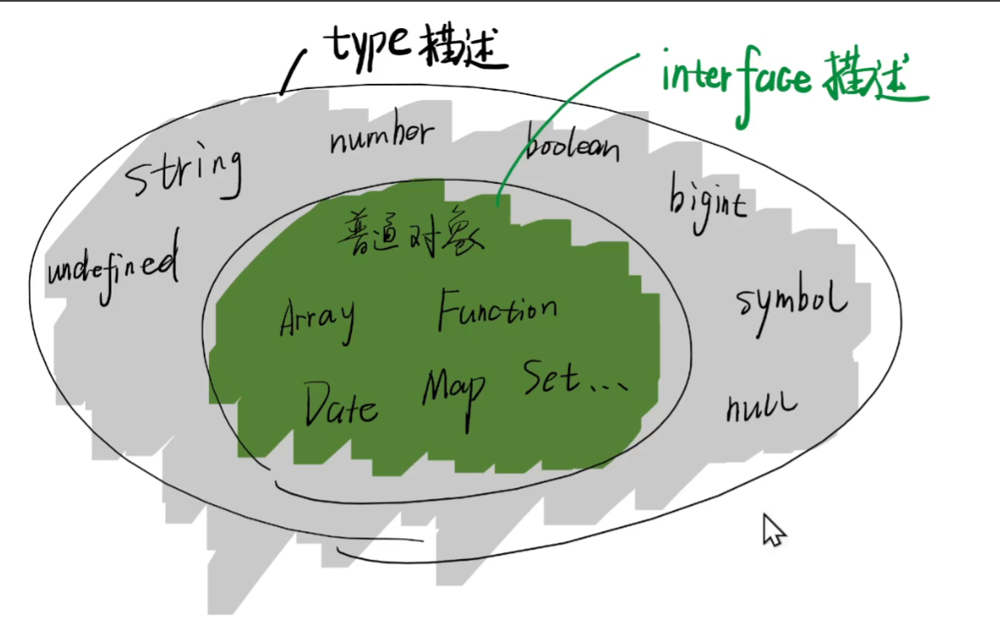

# 接口与类型别名总结

## 区别1

+ `interface` 只描述对象
+ `type` 则 描述所有数据

  

## 区别2

+ `type` 只是别名
+ `interface` 则是类型声明

## 区别3

+ `type` 不可重新赋值

  ```js
  type A = number

  A = string // 报错
  ```

+ `interface` 自动合并

  ```js
  interface X {
    name: string
  }

  interface X {
    age: number
  }

  // 自动合并
  const a:X = {
    name: 'xgg',
    age: 25
  }
  ```

+ 所以

  1. 对外 API 尽量使用 `interface` ，方便扩展
  2. 对内 API 尽量用 `type` ，防止代码分散
