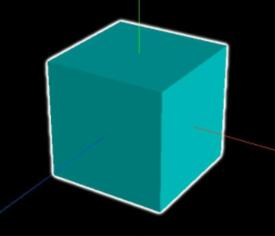

# 后处理(发光描边OutlinePass)

## 概述

+ 查看threejs文件包目录 `examples/jsm/postprocessing/` ，你可以看到Three.js提供了一个扩展库 `EffectComposer.js` ,通过 `EffectComposer` 可以实现一些后期处理效果。

+ 所谓threejs后期处理，就像ps一样，对threejs的渲染结果进行后期处理，比如添加发光效果

## 不同功能后处理通道

+ 查看threejs文件包目录 `examples/jsm/postprocessing/` ，你可以看到threejs提供了很多后处理通道，想实现什么样的后期处理效果，需要调用threejs对应的后处理通道扩展库。

  + `OutlinePass.js`：高亮发光描边
  + `UnrealBloomPass.js`：Bloom发光
  + `GlitchPass.js`：画面抖动效果

+ 比如 `OutlinePass.js` 扩展库提供的类 `OutlinePass` 就可以给一个模型添加一个高亮发光描边，下面就给大家演示下如何实现。

  

## 案例参考

+ threejs文件包examples文件目录，全文检索关键词 `EffectComposer` ，可以找到后处理的很多案例

+ threejs后期处理有很多相关的通道，大家学习的时候，也不可能都记住，平时用到那个通道，可以去 `examples` 文件搜索对应关键词。

+ 全文检索关键词 `UnrealBloomPass` ，可以找到 `Bloom` 发光通道的相关3D案例，你可以参考学习
