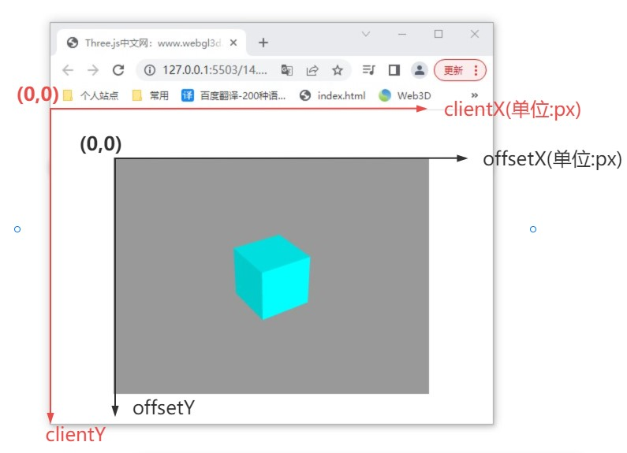
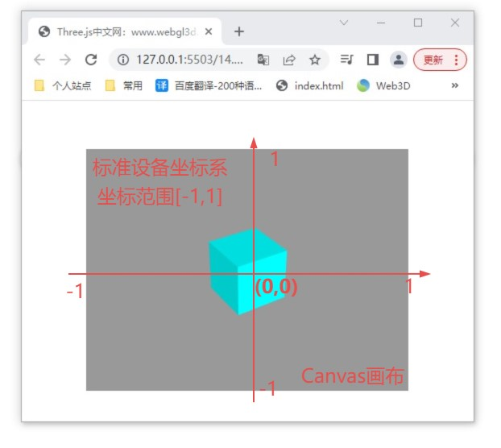

# 屏幕坐标转标准设备坐标

## web前端获取鼠标事件坐标

+ 鼠标单击HTML元素，通过函数的参数鼠标事件对象 `event` ，可以获取一些坐标信息。课件源码中是以threejs的canvas画布为例给大家演示。

  ```js
  addEventListener('click',function(event){
    // event对象有很多鼠标事件相关信息
    console.log('event',event);
  })
  ```

+` .offsetX` 、`.offsetY` 表示鼠标单击位置的坐标，单位是像素px，以点击的HTML元素左上角为坐标原点，水平向右方向为x轴，竖直向下方向为y轴。

  ```js
  addEventListener('click',function(event){
    const px = event.offsetX;
    const py = event.offsetY;
  })
  ```

+ 下图灰色区域是一个HTML元素

  

+ `.clientX`、`.clientY` 和 `.offsetX`、.`offsetY` 含义区别在于坐标原点不同，其他一样

  ```js
  addEventListener('click',function(event){
    const cx = event.clientX;
    const cy = event.clientY;
  })
  ```

+ 特殊情况，如果HTML元素CSS布局中，距离顶部、左侧距离为零，`.clientX`、`.clientY` 和`.offsetX`、`.offsetY` 是相同的

## 标准设备坐标系

+ Three.js Canvas画布具有一个标准设备坐标系，该坐标系的坐标原点在canvas画布的中间位置，x轴水平向右，y轴竖直向上。

+ 标准设备坐标系的坐标值不是绝对值，是相对值，范围是 `[-1,1]` 区间，也是说canvas画布上任何一个位置的坐标，如果用标准设备坐标系去衡量，那么坐标的所有值都在-1到1之间

  

## 屏幕坐标转标准设备坐标方式

+ 你可以用 `.offsetX` 和.offsetY当做canvas画布的屏幕坐标。

+ threejs canvas画布上一个点，可以用`.offsetX`、`.offsetY`绝对值表示，同样也可以用标准设备坐标系去表达

  

+ 把 `.offsetX` 和 `.offsetY` 坐标转化为标准设备坐标坐标

  ```js
  // 坐标转化公式
  addEventListener('click',function(event){
    const px = event.offsetX;
    const py = event.offsetY;
    //屏幕坐标px、py转标准设备坐标x、y
    //width、height表示canvas画布宽高度
    const x = (px / width) * 2 - 1;
    const y = -(py / height) * 2 + 1;
  })
  ```

+ canvas画布的宽度是width，`.offsetX` 的范围是0~width,`.offsetX` 除以canvas画布宽度width，就可以从绝对值变成相对值，范围是0~1，相对值乘以2，范围0~2，再减去1，范围是-1~1，刚好和canvas画布标准设备坐标的范围-1~1能够对应起来。

+ 对于 `.offsetY` 的转标准设备坐标y，和 `.offsetX` 转标准设备坐标x相似，唯一要注意地方就是两个坐标系的y坐标相反，同样计算方式，最后取相反数即可

## 使用.clientX、.clientY计算canvas画布屏幕坐标

+ 用`.offsetX`、`.offsetY`可以直接表示canvas画布屏幕坐标，如果用`.clientX`、`.clientY`表示，这时候要注意，把`.clientX`、`.clientY`转化为以canvas画布左上角为原点的坐标

  ```js
  // 屏幕坐标转标准设备坐标
  addEventListener('click',function(event){
    // left、top表示canvas画布布局，距离顶部和左侧的距离(px)
    const px = event.clientX-left;
    const py = event.clientY-top;
    //屏幕坐标px、py转标准设备坐标x、y
    //width、height表示canvas画布宽高度
    const x = (px / width) * 2 - 1;
    const y = -(py / height) * 2 + 1;
  })
  ```

+ 特殊情况，canvas画布，左上角和网页body右上角重合，比如大部分课程canvas全屏布局的案例。

+ 要注意，把`.clientX`、`.clientY`转化为以canvas画布左上角为原点的坐标

  ```js
  addEventListener('click',function(event){
    const px = event.clientX;
    const py = event.clientY;
    const x = (px / width) * 2 - 1;
    const y = -(py / height) * 2 + 1;
  })
  ```

+ 实际开发的时候，你可以用`.clientX`、`.clientY`计算标准设备坐标，也可以用`.offsetX`、`.offsetY`计算标准设备坐标

