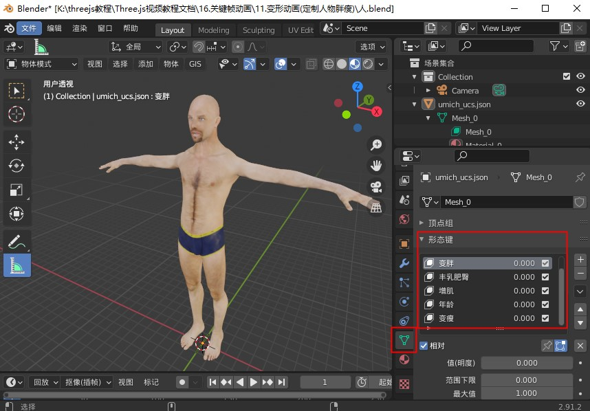

# 变形动画(定制人物胖瘦)

## 概述

+ 先通过三维建模生成几何体的变形目标顶点数据，不用创建关键帧动画，然后通过拖动条，控制变形目标权重系数，控制人物形象的胖瘦

## 查看模型几何体变形相关信息

+ 查看Blender软件中几何体变形信息，可以通过形态键调节查看测试效果

  

+ 课件代码浏览器控制打印人物模型可以看到，有几何体的变形目标顶点数据，但是没有通过关键帧动画设置模型的变形动画效果

  ```js
  loader.load("../人.glb", function (gltf) {
    console.log('控制台查看gltf对象结构', gltf);
    model.add(gltf.scene);
    // 访问人体网格模型
    const mesh = gltf.scene.children[0];
    // 获取所有变形目标的顶点数据
    const tArr = mesh.geometry.morphAttributes.position
    console.log('所有变形目标', tArr);
    console.log('所有权重', mesh.morphTargetInfluences);
    //每个变形目标对应的含义(注意和变形目标对应起来)
    const nameArr = ['变胖', '丰乳肥臀', '增肌', '年龄', '变瘦'];
  })
  ```

## UI界面定制人胖瘦体型

+ 人物模型有多个变形目标，下面随机选择了两个设置拖动条控制变形目标对应的权重系数

  ```js
  import {GUI} from 'three/addons/libs/lil-gui.module.min.js';
  const gui = new GUI();
  const obj = {
    t0: 0,
    t1: 0,
  }
  gui.add(obj, 't0', 0, 1).name('变胖').onChange(function (v) {
    mesh.morphTargetInfluences[0] = v;
  });
  gui.add(obj, 't1', 0, 1).name('丰乳肥臀').onChange(function (v) {
    mesh.morphTargetInfluences[1] = v;
  });
  ```

## 批量设置所有变形目标的拖动条

+ 批量设置所有变形目标的拖动条

  ```js
  import {GUI} from 'three/addons/libs/lil-gui.module.min.js';
  const mesh = gltf.scene.children[0]; // 访问人体网格模型
  // 获取所有变形目标的顶点数据
  const tArr = mesh.geometry.morphAttributes.position
  // 每个变形目标对应的含义(注意和变形目标对应起来)
  const nameArr = ['变胖', '丰乳肥臀', '增肌', '年龄', '变瘦'];
  // GUI拖动条可视化改变变形目标权重系数
  const obj = {};
  const gui = new GUI();
  for (let i = 0; i < tArr.length; i++) {
    obj['t' + i] = 0;//obj批量定义一个属性表示变性目标的权重系数
    // 批量设置要改变的obj属性，对应name名字，和对应权重
    gui.add(obj, 't' + i, 0, 1).name(nameArr[i]).onChange(function (v) {
        mesh.morphTargetInfluences[i] = v;
    });
  }
  ```
