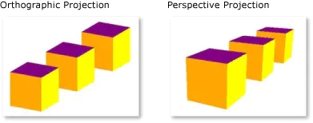

# 正投影相机 OrthographicCamera

## 概述

+ 正交投影，物体发出的光平行地投射到屏幕上，远近的方块都是一样大的

  
  

## API

+ OrthographicCamera( left, right, top, bottom, near, far )

  + left 相机视锥体左面
  + right 相机视锥体右面
  + top 相机视锥体上面
  + bottom 相机视锥体下面
  + near 相机视锥体前面（靠近相机的这一面）
  + far 相机视锥体后面（远离近相机的这一面）

  ```js
  const camera = new THREE.OrthographicCamera(width / -2, width / 2 height / 2, height / -2, 1, 1000)
  ```
