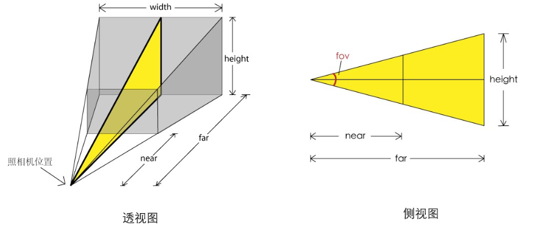

# 远景相机 PerspectiveCamera

## 概述

+ 透视投影，近大远小，符合我们平时看东西的感觉

  
  

## API

+ `PerspectiveCamera(fov, aspect, near, far)`

  + fov 相机视锥体垂直视角（视角大小）

    + 如果设置为0,相当你闭上眼睛了,所以什么也看不到
    + 如果为180,那么可以认为你的视界很广阔,但是在180度的时候，往往物体很小，因为他在你的整个可视区域中的比例变小了

  + aspect ：相机视锥体宽高比。为实际窗口的纵横比，即宽度除以高度。通常设为 `Canvas` 的横纵比例

  + near 相机视锥体近裁剪面 （推荐默认值0.1）
  + far 相机视锥体远裁剪面（推荐默认值1000）

  

  ```js
  const camera = new THREE.PerspectiveCamera(75, width / height, 0.1, 1000);
  ```
