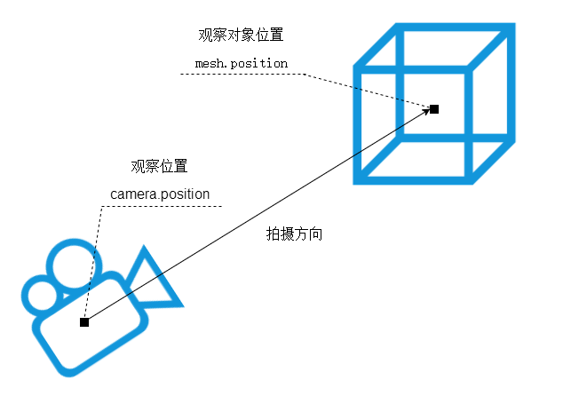

# 相机观察目标 lookAt

## 概述

+ 你用相机拍照你需要控制相机的拍照目标，具体说相机镜头对准哪个物体或说哪个坐标
+ 对于threejs相机而言，就是设置 `.lookAt()` 方法的参数，指定一个3D坐标

  

  ```js
  //相机观察目标指向Threejs 3D空间中某个位置
  camera.lookAt(0, 0, 0); // 坐标原点
  ```

  ```js
  camera.lookAt(0, 10, 0); // y轴上位置10
  ```

  ```js
  camera.lookAt(mesh.position); // 指向mesh对应的位置
  ```
