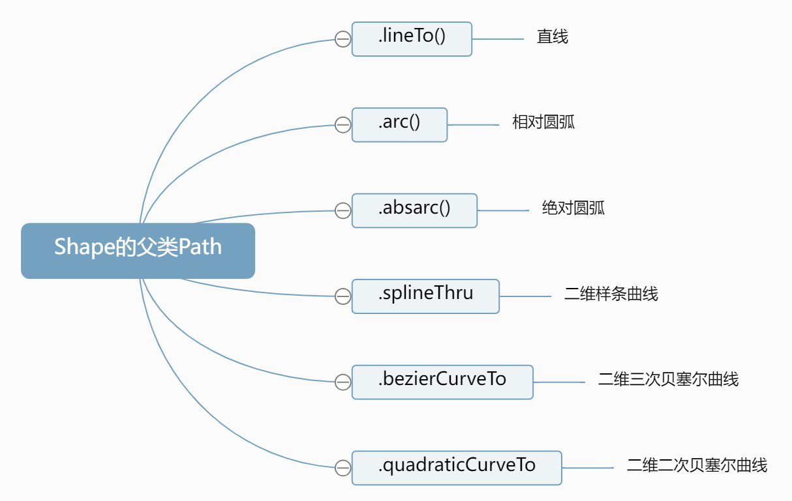

# 多边形轮廓Shape

## 概述

+ 多边形轮廓Shape,是直接通过一组二维向量Vector2表示的xy点坐标创建
+ 下面给大家讲解通过Shape的一些2D绘图API表达多边形轮廓

  ```js
  // Shape表示一个平面多边形轮廓
  const shape = new THREE.Shape([
    // 按照特定顺序，依次书写多边形顶点坐标
    new THREE.Vector2(-50, -50), //多边形起点
    new THREE.Vector2(-50, 50),
    new THREE.Vector2(50, 50),
    new THREE.Vector2(50, -50),
  ]);
  ```

## 多边形轮廓Shape的父类Path

+ Shape的父类是Path,Path提供了直线、圆弧、贝塞尔、样条等绘制方法，Shape也会从父类是Path继承这些图形绘制方法。

+ 如何使用Path的直线、圆弧等绘制方法，可以参考原来学习过的各种曲线API和Path的文档

+ `Shape` 的父类 `Path`

  + `.lineTo()` 直线
  + `.arc()` 相对圆弧
  + `.absarc()` 绝对圆弧
  + `.splineThru()` 二维样条曲线
  + `.bezierCurveTo()` 二维三次贝塞尔曲线
  + `.quadraticCurveTo()` 二维二次贝塞尔曲线

  

## .currentPoint属性

+ `.currentPoint` 属性字面意思是当前点，默认值 `Vector2(0,0)`

+ 实例化一个 `Shape` 或 `Path` 对象，查看 `.currentPoint` 属性的默认值

  ```js
  const shape = new THREE.Shape();
  const path = new THREE.Path();
  console.log('currentPoint',shape.currentPoint);
  ```

## .moveTo()方法

+ 执行和 `.moveTo()` 方法查看 `.currentPoint` 属性变化

  ```js
  const shape = new THREE.Shape();
  shape.moveTo(10,0);
  console.log('currentPoint',shape.currentPoint);
  ```

+ 除了 `.moveTo()` 方法，Path其他的直线、圆弧等方法也可能会改变 `.currentPoint` 属性

## 绘制直线.lineTo()

+ `.lineTo()` 绘制直线线段
+ 直线线段的起点是当前点属性 `.currentPoint` 表示的位置，结束点是 `.lineTo()` 的参数表示的坐标

  ```js
  const shape = new THREE.Shape();
  shape.moveTo(10,0);//.currentPoint变为(10,0)
  // 绘制直线线段，起点(10,0)，结束点(100,0)
  shape.lineTo(100,0);
  ```

+ `.lineTo()` 方法和 `.moveTo()` 方法，一样会改变 `.currentPoint` 属性

  ```js
  shape.lineTo(100,0);//.currentPoint变为(100,0)
  console.log('currentPoint',shape.currentPoint);
  ```

+ 绘制一个矩形轮廓 `Shape`

  ```js
  const shape = new THREE.Shape();
  shape.moveTo(10, 0); //.currentPoint变为(10,0)
  // 绘制直线线段，起点(10,0)，结束点(100,0)
  shape.lineTo(100, 0);//.currentPoint变为(100, 0)
  shape.lineTo(100, 100);//.currentPoint变为(100, 100)
  shape.lineTo(10, 100);//.currentPoint变为(10, 100)
  ```

## 创建好的多边形轮廓Shape作为几何体的参数

+ 创建好的多边形轮廓Shape作为几何体的参数

  ```js
  // ShapeGeometry填充Shape获得一个平面几何体
  const geometry = new THREE.ShapeGeometry(shape);
  ```

  ```js
  // ExtrudeGeometry拉伸Shape获得一个长方体几何体
  const geometry = new THREE.ExtrudeGeometry(shape, {
    depth:20,//拉伸长度
    bevelEnabled:false,//禁止倒角
  });
  ```
