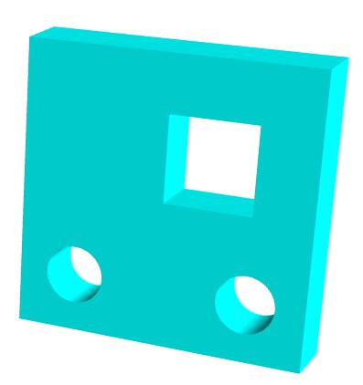

# 多边形Shape(内孔.holes)

## 外轮廓

+ 先创建Shape的矩形外轮廓

  ```js
  const shape = new THREE.Shape();
  // .lineTo(100, 0)绘制直线线段，线段起点：.currentPoint，线段结束点：(100,0)
  shape.lineTo(100, 0);
  shape.lineTo(100, 100);
  shape.lineTo(0, 100);
  ```

## .holes设置内孔的轮廓

+ Path对象创建内部多个轮廓

  ```js
  // Shape内孔轮廓
  const path1 = new THREE.Path();// 圆孔1
  path1.absarc(20, 20, 10);
  const path2 = new THREE.Path();// 圆孔2
  path2.absarc(80, 20, 10);
  const path3 = new THREE.Path();// 方形孔
  path3.moveTo(50, 50);
  path3.lineTo(80, 50);
  path3.lineTo(80, 80);
  path3.lineTo(50, 80);
  ```

  ```js
  //三个内孔轮廓分别插入到holes属性中
  shape.holes.push(path1, path2,path3);
  ```

## Shape拉伸的效果图

+ 上面代码定义的Shape，通过 `ExtrudeGeometry` 拉伸的效果图

  
