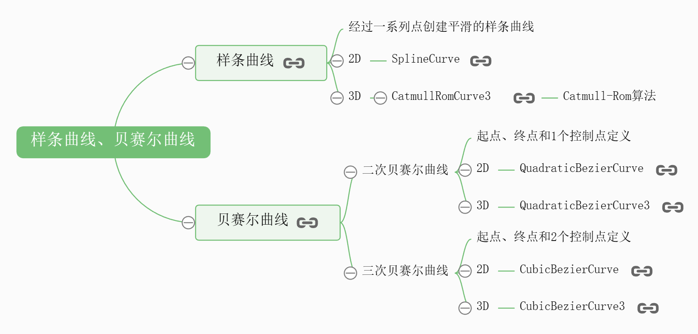

# 贝塞尔曲线

## 概述

+ 对于一些不规则的曲线，很难用一个圆、椭圆或抛物线函数去描述，这时候，可以使用threejs提供的*样条曲线*或贝*塞尔曲线*去表达

  

## 分类

+ 二次贝塞尔曲线

  + 起点、终点和1个控制点定义
  + 2D - QuadraticBezierCurve
  + 3D - QuadraticBezierCurve3

+ 三次贝塞尔曲线

  + 起点、终点和2个控制点定义
  + 2D - CubicBezierCurve
  + 3D - CubicBezierCurve3

## 二维二次贝塞尔曲线QuadraticBezierCurve

+ 二维二次贝塞尔曲线QuadraticBezierCurve

  ```js
  // p1、p2、p3表示三个点坐标

  // p1、p3是曲线起始点，p2是曲线的控制点
  const p1 = new THREE.Vector2(-80, 0);
  const p2 = new THREE.Vector2(20, 100);
  const p3 = new THREE.Vector2(80, 0);
  ```

+ 二维二次贝赛尔曲线 `QuadraticBezierCurve` 的前面三个参数是二维向量对象Vector2

  ```js
  // 二维二次贝赛尔曲线
  const curve = new THREE.QuadraticBezierCurve(p1, p2, p3);
  ```

+ 曲线上获取一定数量点，线模型line渲染贝塞尔曲线

  ```js
  const pointsArr = curve.getPoints(100); //曲线上获取点
  const geometry = new THREE.BufferGeometry();
  geometry.setFromPoints(pointsArr); //读取坐标数据赋值给几何体顶点
  const material = new THREE.LineBasicMaterial({color: 0x00fffff});
  const line = new THREE.Line(geometry, material);
  ```

## 观察贝塞尔曲线规则

+ 可视化p1、p2、p3三个点的位置，并用直线相连接，便于观察贝塞尔曲线的绘制规律。

+ 你可以发现贝塞尔曲线经过p1、p3两个点，但是不经过p2点，贝塞尔曲线与直线p12和p23相切

  ```js
  const geometry2 = new THREE.BufferGeometry();
  geometry2.setFromPoints([p1,p2,p3]);
  const material2 = new THREE.PointsMaterial({
    color: 0xff00ff,
    size: 10,
  });
  //点模型对象
  const points = new THREE.Points(geometry2, material2);
  // 三个点构成的线条
  const line2 = new THREE.Line(geometry2, new THREE.LineBasicMaterial());
  ```

## 三维二次贝赛尔曲线QuadraticBezierCurve3

+ 三维二次贝赛尔曲线 `QuadraticBezierCurve3` 与二维二次贝赛尔曲线 `QuadraticBezierCurve` 区别就是多了一个维度，参数是三维向量对象Vector3

  ```js
  // p1、p2、p3表示三个点坐标
  const p1 = new THREE.Vector3(-80, 0, 0);
  const p2 = new THREE.Vector3(20, 100, 0);
  const p3 = new THREE.Vector3(80, 0, 100);
  // 三维二次贝赛尔曲线
  const curve = new THREE.QuadraticBezierCurve3(p1, p2, p3);
  ```

## 二维三次贝塞尔曲线CubicBezierCurve

+ 二维三次贝塞尔曲线 `CubicBezierCurve` 与二维二次贝赛尔曲线 `QuadraticBezierCurv` e区别就是多了一个控制点

  ```js
  // p1、p2、p3、p4表示4个点坐标
  // p1、p4是曲线起始点，p2、p3是曲线的控制点
  const p1 = new THREE.Vector2(-80, 0);
  const p2 = new THREE.Vector2(-40, 50);
  const p3 = new THREE.Vector2(50, 50);
  const p4 = new THREE.Vector2(80, 0);

  // 二维三次贝赛尔曲线
  const curve = new THREE.CubicBezierCurve(p1, p2, p3, p4);
  ```

## 三维三次贝赛尔曲线CubicBezierCurve3

+ 三维三次贝赛尔曲线 `CubicBezierCurve3` 与二维三次贝塞尔曲线 `CubicBezierCurve` 区别就是多了一个维度，参数是三维向量对象Vector3

  ```js
  const p1 = new THREE.Vector3(-80, 0, 0);
  const p2 = new THREE.Vector3(-40, 50, 0);
  const p3 = new THREE.Vector3(50, 50, 0);
  const p4 = new THREE.Vector3(80, 0, 100);
  // 三维三次贝赛尔曲线
  const curve = new THREE.CubicBezierCurve3(p1, p2, p3, p4);
  ```
