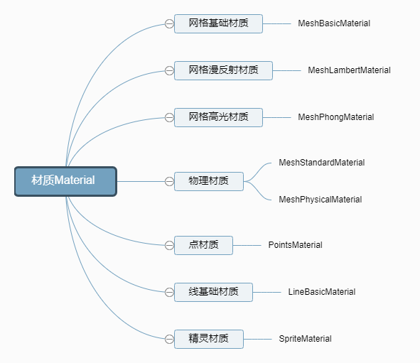

# 基础

## 概述

+ 材质（Material）是与渲染效果相关的属性。通过设置材质可以改变物体的颜色、纹理贴图、光照模式等。材质的共有属性包括

  + id：用来标识材质。
  + name：赋予材质名称。
  + opacity：定义物体透明度，取值范围0~1
  + side：设定在几何体的哪个面应用材质，默认值为 `THREE.FrontSide` ，即外面。也可以设置为 `THREE.BackSide` （内面）或 `THREE.DoubleSide` （双面）

  ```js
  const material = new THREE.LineBasicMaterial( {
    color: 0xffffff,
    linewidth: 1,
    linecap: 'round', //ignored by WebGLRenderer
    linejoin:  'round' //ignored by WebGLRenderer
  });
  ```

## 材质分类

+ 网格材质

  + 不受光照影响

    + 基础 `BasicMaterial`

  + 受光照影响

    + 漫反射 `MeshLambertMaterial`
    + 高光 `MeshPhongMaterial`
    + 物理 `MeshStandardMaterial` 和 `MeshPhysicalMaterial`

  
  

## 光照模型

+ Three.js会提供一些的光照模型来模拟物体表面的光照，光照模型就一种模拟光照的计算方法
+ `MeshPhysicalMaterial` 和 `MeshLambertMaterial` 一样都是渲染网格模型的材质，但是他们用的光照模型不同，具体点说就是材质模拟 `Mesh` 反射光照的代码算法不同，算法不同，自然模拟光照的真实程度也不同

## 渲染占用资源和表现能力

+ 整体上来看，就是渲染表现能力越强，占用的计算机硬件资源更多

+ 占用渲染资源 `MeshBasicMaterial` < `MeshLambertMaterial` < `MeshPhongMaterial` < `MeshStandardMaterial` < `MeshPhysicalMaterial`

+ 渲染表现能力 `MeshBasicMaterial` < `MeshLambertMaterial` < `MeshPhongMaterial` < `MeshStandardMaterial` < `MeshPhysicalMaterial`
