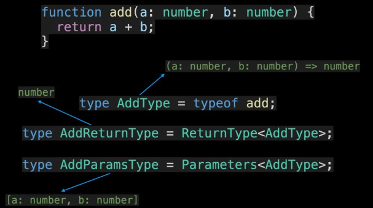

# typeof

## 概述

*   TS中

    *   `typeof` 操作符用于获取变量的类型

    *   因此这个操作符的后面接的始终是一个**变量**，且需要运用到类型定义当中

    *   可以将 `JS` 转成 `TS`

        

## 基础类型

*   TypeScript 添加了一个`typeof`运算符，您可以在\_类型\_上下文中使用它来引用变量或属性的类型

    ```typescript
    let s = "hello";
    let n: typeof s; // let n: string
    ```

## 对象

*   对一个对象使用 `typeof`

    ```typescript
    const lolo = {
      name: "lolo",
      age: 7,
      address: {
        province: "福建",
        city: "厦门",
      },
    };

    type Person = typeof lolo;
    type Address = typeof lolo["address"];

    ```

    

## 类型别名type

*   代码

    ```typescript
    type Person = {
      name: string;
      age: number;
    }

    let man: Person = {
      name: "Semlinker",
      age: 30
    }

    type Human = typeof man;
    ```

## 函数

*   对一个函数使用 `typeof`，获取对应函数类型

    ```typescript
    function add(a: number, b: number) {
      return a + b;
    }

    type AddType = typeof add; // (a: number, b: number) => number
    type AddReturnType = ReturnType<AddType> // number
    type AddParamsType = Parameters<AddType> // [a: number, b: number]
    ```

*   可以继续利用 TypeScript 内置的 `ReturnType` 和 `Parameters` 工具类型来分别获取函数的返回值类型和参数类型

    

## 枚举

*   利用 `keyof` 和 `typeof` 操作符，你就可以获取枚举类型的所有属性名

    ```typescript
    enum HttpMethod {
      Get,
      Post,
    }

    const method: typeof HttpMethod = {
      Get: 0,
      Post: 1,
    };

    type Method = keyof typeof HttpMethod; // "Get" | "Post"
    ```

    

## 获取数组元素类型

*   用 `number` 来获取数组元素的类型。结合 `typeof` 可以方便的捕获数组字面量的元素类型

    ```typescript
    const MyArray = [
      { name: "Alice", age: 15 },
      { name: "Bob", age: 23 },
      { name: "Eve", age: 38 },
    ];
     
    type Person = typeof MyArray[number];
           
    // type Person = {
    //    name: string;
    //    age: number;
    // }

    type Age = typeof MyArray[number]["age"];  
    // type Age = number

    // Or
    type Age2 = Person["age"];   
    // type Age2 = number
    ```

## 搭配const断言

*   在使用 typeof 操作符的过程中，如果你想要获取更精确的类型，那么你可以结合 TypeScript 3.4 版本中引入的 `const` 断言

    ```typescript
    let requestMethod = "Get";
    let requestMethod2 = "Get" as const;

    type R0 = typeof requestMethod; // string
    type R1 = typeof requestMethod2; // "Get"
    ```

    ```typescript
    let user = {
      id: 666,
      name: "阿宝哥",
    };

    let user2 = {
      id: 666,
      name: "阿宝哥",
    } as const;

    // { id: number; name: string; }
    type U0 = typeof user;
    // type U1 = { readonly id: 666; readonly name: "阿宝哥"; }
    type U1 = typeof user2;
    ```

    

## 限制

*   TypeScript 有意的限制了可以使用 `typeof` 的表达式的种类

*   在 TypeScript 中，只有对**标识符**（比如**变量名**）或者他们的属性使用 `typeof` 才是合法的
