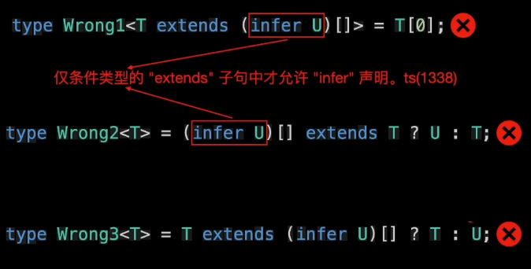

# 推导infer

## 概述

*   用于声明类型变量，存储在模式匹配过程中所捕获的类型

## 注意点

*   `infer` 只能在条件类型的 `extends` 子句中使用

*   `infer` 声明的类型变量只能在条件类型的`true`分支中使用

*   错误使用

    

## 示例-获取数组类型中元素的类型

*   示例

    ```typescript
    type UnpackedArray<T> = T extends (infer U)[] ? U : T;
    type T0 = string[];
    type U0 = UnpackedArray<T0>; // string
    // 等价于
    type U1 = string; // 可以获取到数组类型 T0 中的元素类型为 string
    ```

*   执行流程

    

## 示例

*   获取函数类型的返回值类型

    ```typescript
    type UnpackedFn<T> = T extends () => infer U ? U : T;

    type T1 = UnpackedFn<() => string> // string;
    type T2 = UnpackedFn<'str'> // 'str'
    ```

*   Promise

    ```typescript
    type Unpacked<T> = T extends Promise<infer U> ? U : T;
    ```

*   对象类型

    ```typescript
    type User = {
      id: number;
      name: string;
    }

    type PropertyType<T> = T extends { id: infer U, name: infer R } ? [U,R] : T;
    type U3 = PropertyType<User>; // [number, string]


    ```
