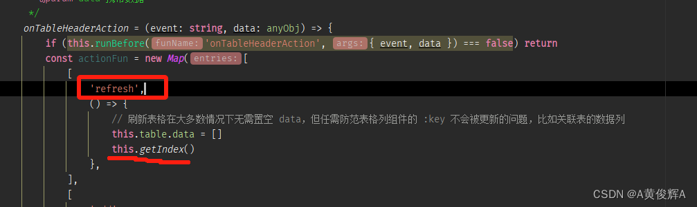
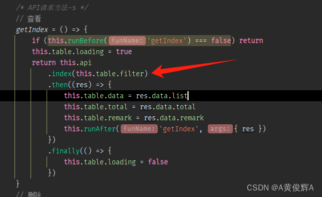
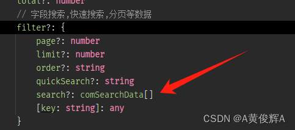

# 自定义组装搜索的查询

## 概述

+ 自定义组装一些数据，发送给后端，让后端来进行筛选

  ```js
  const onComSearchIdEq = () => {
    // 展开公共搜索
    baTable.table.showComSearch = true
    /**
     * 公共搜索表单赋值
     * 范围搜索有两个输入框，输入框绑定变量分别为 `字段名-start` 和 `字段名-end`
     * 当前是范围搜索的等于示例，所以 start 和 end 均为1
     */
    baTable.comSearch.form = Object.assign(baTable.comSearch.form, {
        'id-start': 1,
        'id-end': 1,
    })

    /**
     * 组装发送给服务端的筛选条件数据
     */
    const fieldDataTemp = baTable.comSearch.fieldData.get('id') // 获取 id 字段的公共搜索数据，它由 baTable 自动初始化
    if (fieldDataTemp) {
      // 筛选数据组装
      let comSearchData: comSearchData = {
        field: 'id', // 筛选字段
        val: '1,1', // 范围查询的 start 值和 end 值，直接使用逗号分隔
        operator: fieldDataTemp.operator, // 公共搜索操作符号
        render: fieldDataTemp.render, // 字段渲染方案
      }
      let index = getArrayKey(baTable.table.filter!.search!, 'field', 'id') // 查询是否已经有 id 字段的筛选数据
      if (!index) {
        // push 到要发送给服务端的筛选条件数组中
        baTable.table.filter!.search!.push(comSearchData) // 无则 push
      } else {
        baTable.table.filter!.search![index] = comSearchData // 有则重新赋值
      }

      // 重新请求表格数据（刷新表格）
      baTable.onTableHeaderAction('refresh', {})
    } else {
      console.log('没有找到 id 字段的公共搜索数据，因为该字段禁止了公共搜索')
    }
  }
  ```

+ 从上面的代码中， 可以看到， 主要是组装了一个 comSearchData的数组，之后调用， `baTable.onTableHeaderAction(‘refresh’,{})` 的方法刷新了一下表格就可以了
+ 为什么是这样就可以了
+ 找到 refresh 方法， 调用了 getIndex()方法

  
  
  
