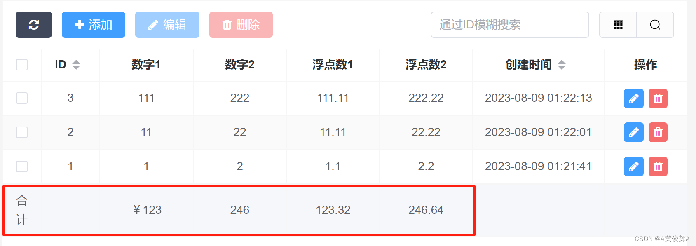
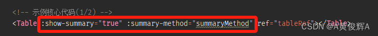
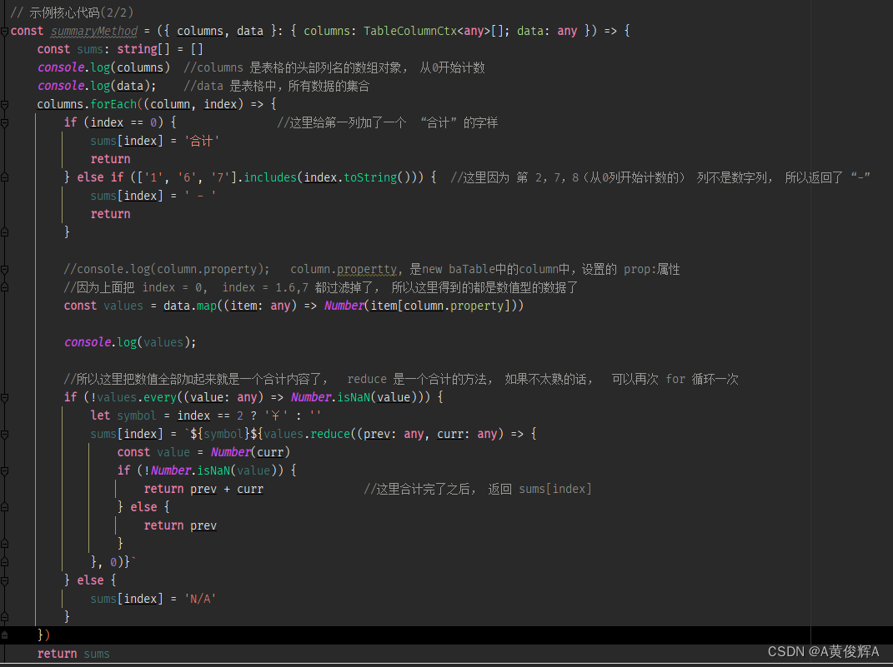

# 表格下方添加 合计行

## 概述

+ 表格的下方可以自定义添加一个合计行，如果有其它的需求， 我们可以添加我们自已需要的行， 并不局限于合计行

  
  
  

  ```html
  <template>
    <div class="default-main ba-table-box">
      <el-alert class="ba-table-alert" v-if="baTable.table.remark" :title="baTable.table.remark" type="info" show-icon />

      <TableHeader
        :buttons="['refresh', 'add', 'edit', 'delete', 'comSearch', 'quickSearch', 'columnDisplay']"
        :quick-search-placeholder="t('Quick search placeholder', { fields: t('examples.table.summary.quick Search Fields') })"
      ></TableHeader>

      <!-- 示例核心代码(1/2) -->
      <Table :show-summary="true" :summary-method="summaryMethod" ref="tableRef"></Table>

      <PopupForm />
    </div>
  </template>

  <script setup lang="ts">
  import { ref, provide, onMounted } from 'vue'
  import baTableClass from '/@/utils/baTable'
  import { defaultOptButtons } from '/@/components/table'
  import { baTableApi } from '/@/api/common'
  import { useI18n } from 'vue-i18n'
  import PopupForm from './popupForm.vue'
  import Table from '/@/components/table/index.vue'
  import TableHeader from '/@/components/table/header/index.vue'
  import type { TableColumnCtx } from 'element-plus'

  defineOptions({
    name: 'examples/table/summary',
  })

  const { t } = useI18n()
  const tableRef = ref()
  const optButtons: OptButton[] = defaultOptButtons(['edit', 'delete'])

  // 示例核心代码(2/2)
  const summaryMethod = ({ columns, data }: { columns: TableColumnCtx<any>[]; data: any }) => {
    const sums: string[] = []
    console.log(columns)  //columns 是表格的头部列名的数组对象， 从0开始计数
    console.log(data);    //data 是表格中，所有数据的集合
    columns.forEach((column, index) => {
      if (index == 0) {               //这里给第一列加了一个  “合计” 的字样
        sums[index] = '合计'
        return
      } else if (['1', '6', '7'].includes(index.toString())) {  //这里因为 第 2，7，8（从0列开始计数的） 列不是数字列， 所以返回了 “-”
        sums[index] = ' - '
        return
      }

      //console.log(column.property);   column.propertty, 是new baTable中的column中，设置的 prop:属性
      //因为上面把 index = 0,  index = 1.6,7 都过滤掉了， 所以这里得到的都是数值型的数据了
      const values = data.map((item: any) => Number(item[column.property]))

      console.log(values);

      //所以这里把数值全部加起来就是一个合计内容了，  reduce 是一个合计的方法， 如果不太熟的话，  可以再次 for 循环一次
      if (!values.every((value: any) => Number.isNaN(value))) {
        let symbol = index == 2 ? '￥' : ''
        sums[index] = `${symbol}${values.reduce((prev: any, curr: any) => {
          const value = Number(curr)
          if (!Number.isNaN(value)) {
            return prev + curr               //这里合计完了之后， 返回 sums[index]
          } else {
            return prev
          }
        }, 0)}`
      } else {
        sums[index] = 'N/A'
      }
    })
    return sums
  }

  const baTable = new baTableClass(
    new baTableApi('/admin/examples.table.Summary/'),
    {
      pk: 'id',
      column: [
        { type: 'selection', align: 'center', operator: false },
        { label: t('examples.table.summary.id'), prop: 'id', align: 'center', width: 70, operator: 'RANGE', sortable: 'custom' },
        { label: t('examples.table.summary.number1'), prop: 'number1', align: 'center', operator: 'RANGE', sortable: false },
        { label: t('examples.table.summary.number2'), prop: 'number2', align: 'center', operator: 'RANGE', sortable: false },
        { label: t('examples.table.summary.float1'), prop: 'float1', align: 'center', operator: 'RANGE', sortable: false },
        { label: t('examples.table.summary.float2'), prop: 'float2', align: 'center', operator: 'RANGE', sortable: false },
        {
          label: t('examples.table.summary.create_time'),
          prop: 'create_time',
          align: 'center',
          render: 'datetime',
          operator: 'RANGE',
          sortable: 'custom',
          width: 160,
          timeFormat: 'yyyy-mm-dd hh:MM:ss',
        },
        { label: t('Operate'), align: 'center', width: 100, render: 'buttons', buttons: optButtons, operator: false },
      ],
      dblClickNotEditColumn: [undefined],
    },
    {
      defaultItems: { number1: 0, number2: 0, float1: 0, float2: 0 },
    }
  )

  provide('baTable', baTable)

  onMounted(() => {
    baTable.table.ref = tableRef.value
    baTable.mount()
    baTable.getIndex()?.then(() => {
      baTable.initSort()
      baTable.dragSort()
    })
  })
  </script>
  ```


