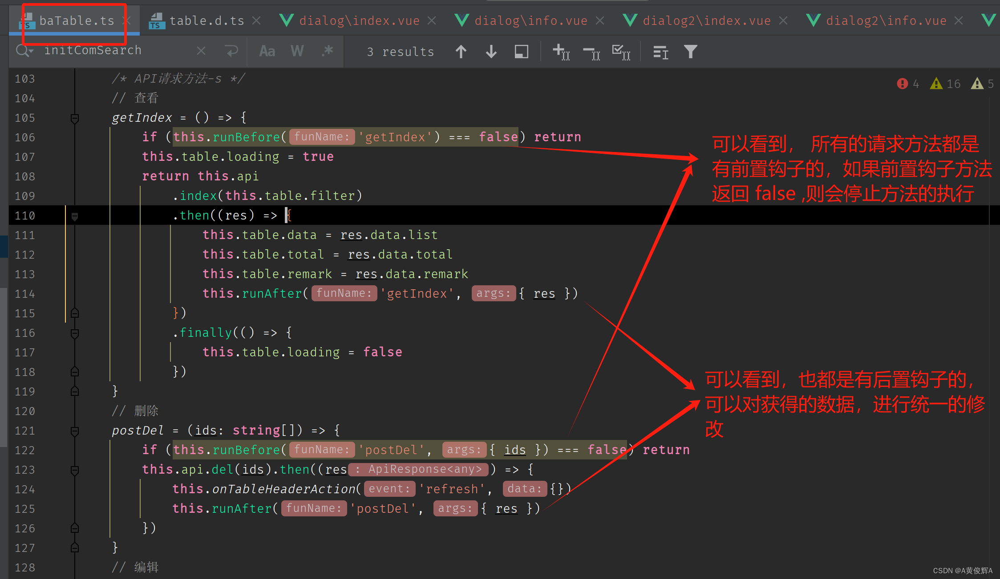
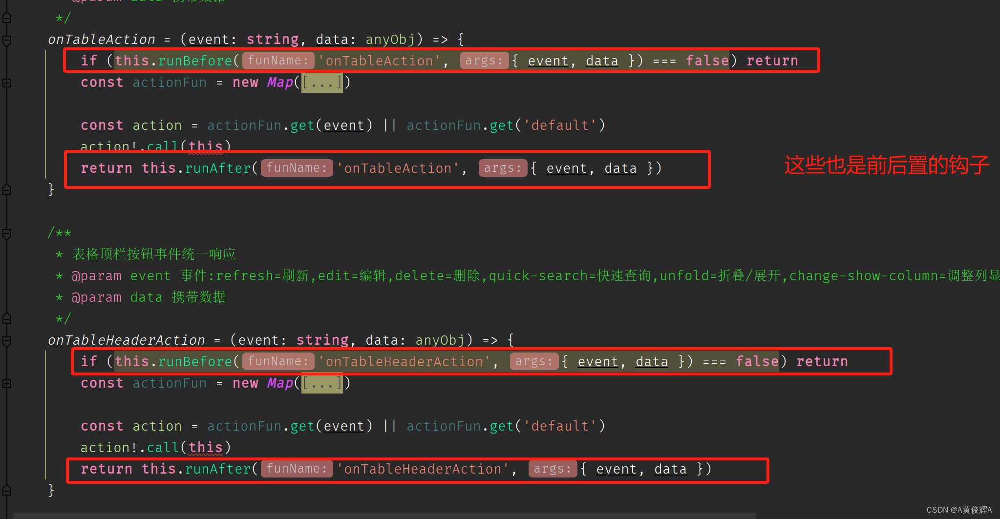

# 表格的事件监听

## baTable类钩子函数

+ buildadmin 中的事件都已经在 baTable类中定义好了
+ 我们一般不会去修改，万一我们要在事件上有所操作， 我们可以通过事件的 前置和后置 钩子函数来处理

  
  

+ 使用这些钩子

  + 只需要在 创建对象的时候，定义好这些钩子就可以了
  + 如下例中， baTable类 创建对象的进候，就添加了相应的 before after 钩子

    ```js
    const baTable = new baTableClass(
      new baTableApi('/admin/examples.table.Event/'),
      {
        pk: 'id',
        column: [
          { type: 'selection', align: 'center', operator: false },
          { label: t('examples.table.event.id'), prop: 'id', align: 'center', width: 70, operator: 'RANGE', sortable: 'custom' },
          {
            label: t('examples.table.event.string'),
            prop: 'string',
            align: 'center',
            operatorPlaceholder: t('Fuzzy query'),
            operator: 'LIKE',
            sortable: false,
          },
          {
            label: t('examples.table.event.switch'),
            prop: 'switch',
            align: 'center',
            render: 'switch',
            operator: 'eq',
            sortable: false,
            replaceValue: { '0': t('examples.table.event.switch 0'), '1': t('examples.table.event.switch 1') },
          },
          { label: t('examples.table.event.datetime'), prop: 'datetime', align: 'center', operator: 'eq', sortable: 'custom', width: 160 },
          {
            label: t('examples.table.event.create_time'),
            prop: 'create_time',
            align: 'center',
            render: 'datetime',
            operator: 'RANGE',
            sortable: 'custom',
            width: 160,
            timeFormat: 'yyyy-mm-dd hh:MM:ss',
          },
          { label: t('Operate'), align: 'center', width: 100, render: 'buttons', buttons: optButtons, operator: false },
        ],
        dblClickNotEditColumn: [undefined, 'switch'],
      },
      {
        defaultItems: { switch: '1', datetime: null },
      },
      {
        // 示例核心代码(1/2)
        // 操作前置钩子，return false 可取消原操作
        getIndex() {
          console.info('%c-------获取表格数据前置--------', 'color:blue')
        },
        postDel({ ids }) {
          console.info('%c-------请求删除前置--------', 'color:blue')
          console.log('被删除数据', ids)
        },
        requestEdit({ id }) {
          console.info('%c-------请求编辑前置--------', 'color:blue')
          console.log('被编辑数据', id)
        },
        onTableDblclick({ row, column }) {
          console.info('%c-------双击了单元格，双击具体操作执行前置--------', 'color:blue')
          console.log('双击携带了数据', row, column)
        },
        toggleForm({ operate, operateIds }) {
          console.info('%c-------表单切换前置--------', 'color:blue')
          console.log('表单切换携带了数据', operate, operateIds)
        },
        onSubmit({ formEl, operate, items }) {
          console.info('%c-------表单提交前置（尚未请求提交）--------', 'color:blue')
          console.log('表单提交前携带了数据，您可以在此对数据进行预处理', formEl, operate, items)
        },
        onTableAction({ event, data }) {
          console.info('%c-------表格内部事件 - 前置--------', 'color:blue')
          console.log('触发的事件和携带的数据为', event, data)
        },
        onTableHeaderAction({ event, data }) {
          console.info('%c-------表头事件 - 前置--------', 'color:blue')
          console.log('触发的事件和携带的数据为', event, data)
        },
        mount() {
          console.info('%c-------表格初始化前置--------', 'color:blue')
        },
      },
      {
        // 示例核心代码(2/2)
        getIndex({ res }) {
          console.info('%c-------获取表格数据后置--------', 'color:green')
          console.log('获取数据请求的响应', res)
        },
        postDel({ res }) {
          console.info('%c-------请求删除后置--------', 'color:green')
          console.log('删除请求的响应', res)
        },
        requestEdit({ res }) {
          console.info('%c-------请求编辑后置--------', 'color:green')
          console.log('编辑请求的响应', res)
        },
        onTableDblclick({ row, column }) {
          console.info('%c-------双击了单元格，双击具体操作执行后置--------', 'color:green')
          console.log('双击携带了数据', row, column)
        },
        toggleForm({ operate, operateIds }) {
          console.info('%c-------表单切换后置--------', 'color:green')
          console.log('表单切换携带了数据', operate, operateIds)
        },
        onSubmit({ res }) {
          console.info('%c-------表单提交后置（已经发送请求）--------', 'color:green')
          console.log('表单提交请求的响应', res)
        },
        onTableAction({ event, data }) {
          console.info('%c-------表格内部事件 - 后置--------', 'color:green')
          console.log('触发的事件和携带的数据为', event, data)
        },
        onTableHeaderAction({ event, data }) {
          console.info('%c-------表头事件 - 后置--------', 'color:green')
          console.log('触发的事件和携带的数据为', event, data)
        },
      }
    )
    ```

## el-table中的事件

+ 因为buildAdmin是封装的 el-table的组件，所以el-table中的事件， 也是可以使用的， 两者有几个事件是有共同的（比如 双击事件）， 这时可以根据自己的需要自行选择

+ 以下代码是 buildadmin 使用 el-table中的事件的例子
+ 可以看到， table 组件中 绑定了很多的事件， 这些事件都是 el-table的事件

  

  ```html
  <template>
    <div class="default-main ba-table-box">
      <el-alert class="ba-table-alert" type="info" show-icon>
      <template #default>
          <div class="ba-markdown">
            <div>对表格内各种行为事件的监听示例，<code>el-table 事件</code></div>
            <div>1、请按下<code>F12</code>从浏览器控制台查看更多细节</div>
            <div>2、请单击/右击/双击单元格、行、表头等触发 el-table 事件</div>
          </div>
        </template>
      </el-alert>

      <TableHeader
        :buttons="['refresh', 'add', 'edit', 'delete', 'comSearch', 'quickSearch', 'columnDisplay']"
        :quick-search-placeholder="t('Quick search placeholder', { fields: t('examples.table.event2.quick Search Fields') })"
      ></TableHeader>

      <!-- 示例核心代码(1/2) -->
      <!-- 我们在此示例了 el-table 的各种事件 -->
      <!-- 以此类推，el-table 自带的属性也都是可以使用的 -->
      <Table
        @cell-mouse-enter="onCellMouseEnter"
        @cell-mouse-leave="onCellMouseLeave"
        @cell-click="onCellClick"
        @cell-contextmenu="onCellContextmenu"
        @row-click="onRowClick"
        @row-contextmenu="onRowContextmenu"
        @row-dblclick="onDblclick"
        @header-click="onHeaderClick"
        @header-contextmenu="onHeaderContextmenu"
        @header-dragend="onHeaderDragend"
        ref="tableRef"
      ></Table>

      <!-- 温馨提示 -->
      <!-- 事件 select、select-all、selection-change、cell-dblclick、sort-change 请使用 ba-table 的钩子 -->
      <!-- 事件 filter-change	可用，但请自行实现筛选，buildadmin 并未使用 el 提供的表格筛选模式 -->

      <PopupForm />
    </div>
  </template>

  <script setup lang="ts">
  import { ref, provide, onMounted } from 'vue'
  import baTableClass from '/@/utils/baTable'
  import { defaultOptButtons } from '/@/components/table'
  import { baTableApi } from '/@/api/common'
  import { useI18n } from 'vue-i18n'
  import PopupForm from './popupForm.vue'
  import Table from '/@/components/table/index.vue'
  import TableHeader from '/@/components/table/header/index.vue'

  defineOptions({
    name: 'examples/table/event2',
  })

  const { t } = useI18n()
  const tableRef = ref()
  const optButtons: OptButton[] = defaultOptButtons(['edit', 'delete'])

  /**
   * 示例核心代码(2/2)
   */
  const onCellMouseEnter = (row: TableRow, column: TableColumn, cell: HTMLElement, event: MouseEvent) => {
    console.info('%c-------单元格 hover 进入--------', 'color:blue')
    console.log('参数', row, column, cell, event)
  }

  const onCellMouseLeave = (row: TableRow, column: TableColumn, cell: HTMLElement, event: MouseEvent) => {
    console.info('%c-------单元格 hover 退出--------', 'color:blue')
    console.log('参数', row, column, cell, event)
  }

  const onCellClick = (row: TableRow, column: TableColumn, cell: HTMLElement, event: PointerEvent) => {
    console.info('%c-------单元格被点击--------', 'color:blue')
    console.log('参数', row, column, cell, event)
  }

  const onCellContextmenu = (row: TableRow, column: TableColumn, cell: HTMLElement, event: PointerEvent) => {
    console.info('%c-------单元格被右击--------', 'color:blue')
    console.log('参数', row, column, cell, event)
  }

  const onRowClick = (row: TableRow, column: TableColumn, event: PointerEvent) => {
    console.info('%c-------某一行被点击--------', 'color:blue')
    console.log('参数', row, column, event)
  }

  const onRowContextmenu = (row: TableRow, column: TableColumn, event: PointerEvent) => {
    console.info('%c-------某一行被右击--------', 'color:blue')
    console.log('参数', row, column, event)
  }

  const onDblclick = (row: TableRow, column: TableColumn, event: MouseEvent) => {
    console.info('%c-------某一行被双击--------', 'color:blue')
    console.log('参数', row, column, event)
  }

  const onHeaderClick = (column: TableColumn, event: PointerEvent) => {
    console.info('%c-------表头被点击--------', 'color:blue')
    console.log('参数', column, event)
  }

  const onHeaderContextmenu = (column: TableColumn, event: PointerEvent) => {
    console.info('%c-------表头被右击--------', 'color:blue')
    console.log('参数', column, event)
  }

  const onHeaderDragend = (newWidth: number, oldWidth: number, column: TableColumn, event: MouseEvent) => {
    console.info('%c-------列宽度改变--------', 'color:blue')
    console.log(newWidth, oldWidth, column, event)
  }

  const baTable = new baTableClass(
    new baTableApi('/admin/examples.table.Event2/'),
    {
      pk: 'id',
      column: [
        { type: 'selection', align: 'center', operator: false },
        { label: t('examples.table.event2.id'), prop: 'id', align: 'center', width: 70, operator: 'RANGE', sortable: 'custom' },
        {
          label: t('examples.table.event2.string'),
          prop: 'string',
          align: 'center',
          operatorPlaceholder: t('Fuzzy query'),
          operator: 'LIKE',
          sortable: false,
        },
        {
          label: t('examples.table.event2.switch'),
          prop: 'switch',
          align: 'center',
          render: 'switch',
          operator: 'eq',
          sortable: false,
          replaceValue: { '0': t('examples.table.event2.switch 0'), '1': t('examples.table.event2.switch 1') },
        },
        { label: t('examples.table.event2.datetime'), prop: 'datetime', align: 'center', operator: 'eq', sortable: 'custom', width: 160 },
        {
          label: t('examples.table.event2.create_time'),
          prop: 'create_time',
          align: 'center',
          render: 'datetime',
          operator: 'RANGE',
          sortable: 'custom',
          width: 160,
          timeFormat: 'yyyy-mm-dd hh:MM:ss',
        },
        { label: t('Operate'), align: 'center', width: 100, render: 'buttons', buttons: optButtons, operator: false },
      ],
      dblClickNotEditColumn: [undefined, 'switch'],
    },
    {
      defaultItems: { switch: '1', datetime: null },
    }
  )

  provide('baTable', baTable)

  onMounted(() => {
    baTable.table.ref = tableRef.value
    baTable.mount()
    baTable.getIndex()?.then(() => {
      baTable.initSort()
      baTable.dragSort()
    })
  })
  </script>

  ```


