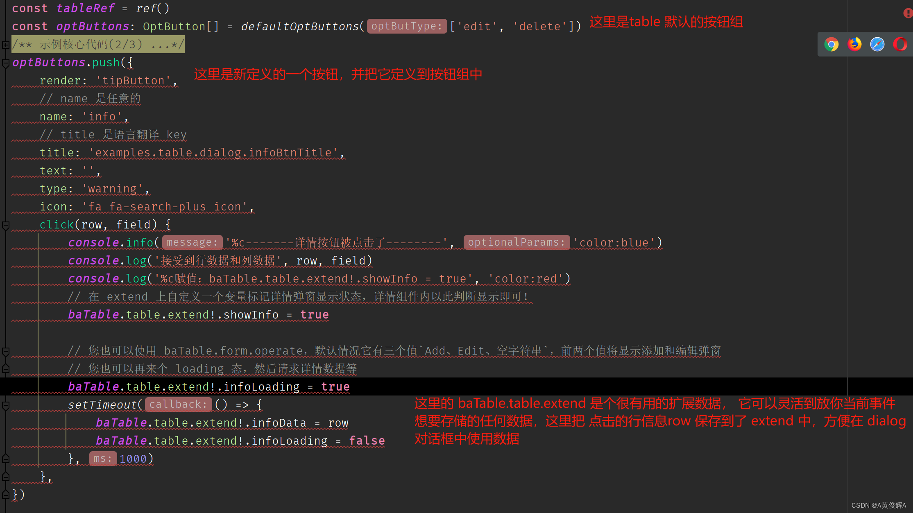
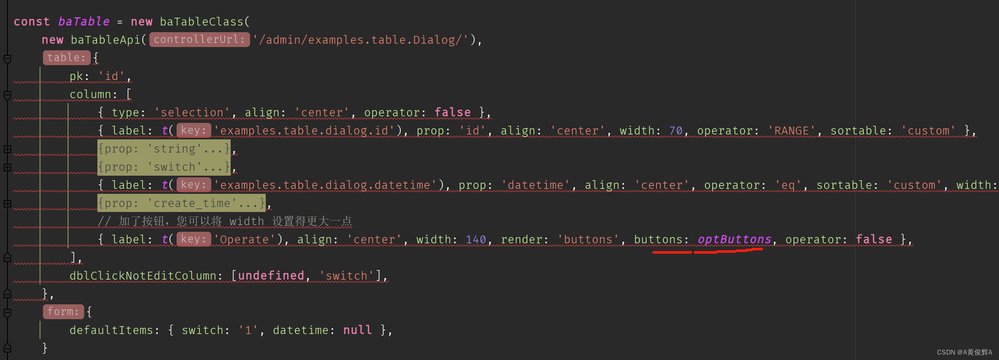
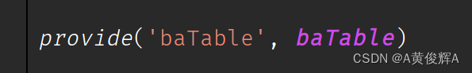
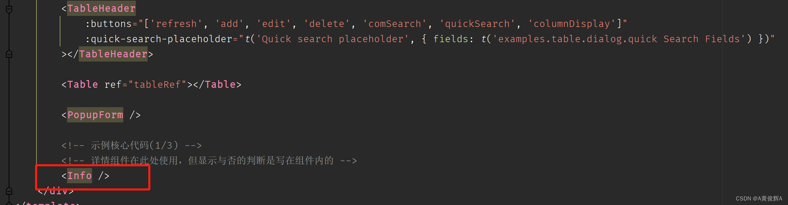
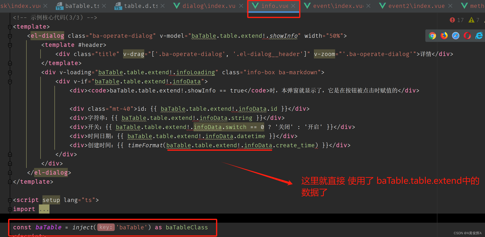
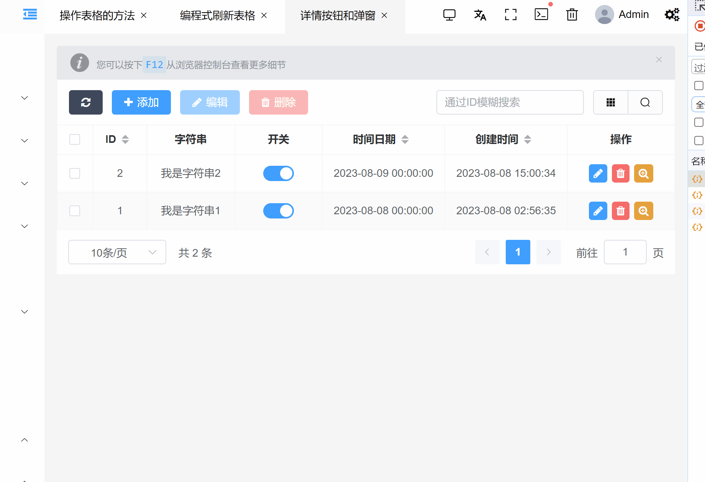
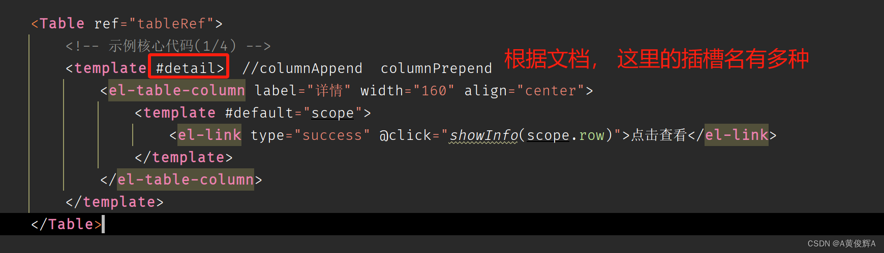
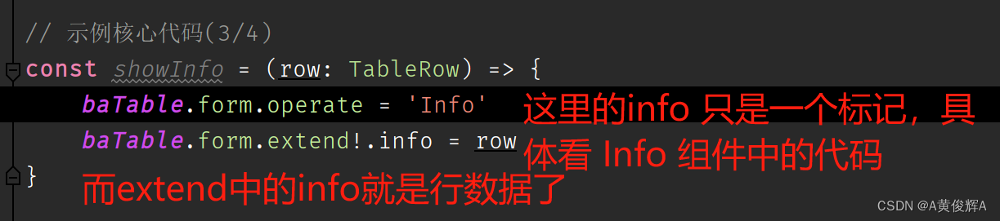
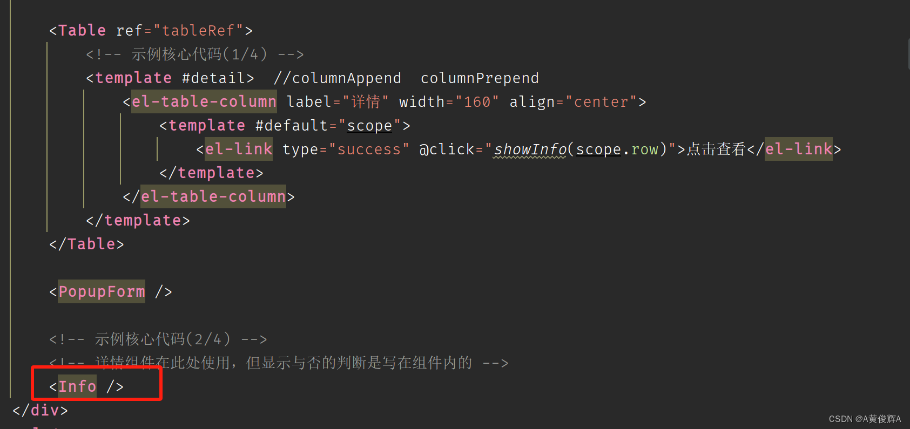
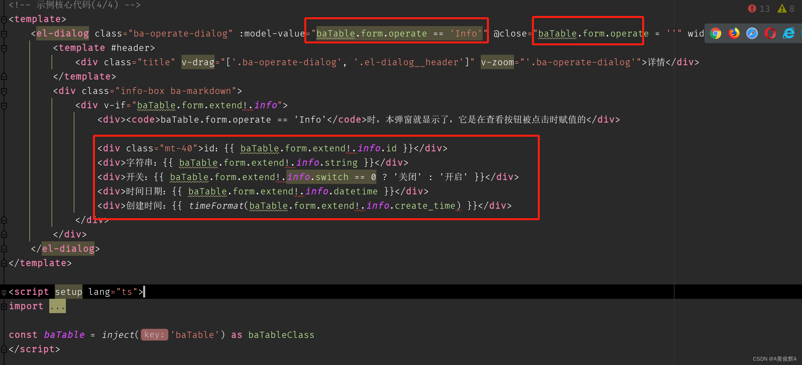

# 表格行中添加详情按钮并弹出对话框

## 添加按钮，查看详情

+ 在表格行中添加按钮

  
  

+ dialog的 对话框中是怎么拿到数据的

  

+ 那么 它的子组件中， 都可以获取到这个对象，所以， 有弹出框的 Info 组件，也可以获取到

  
  
  

## 添加一个列，查看详情

+ 首先要在 table 组件中添加任意的template

  

+ 添加了 template 同时我们还要在 baTable的类中添加 一个 render:slot的列，表指明添加的列显示的位置

  

+ 然后在添加的 template列中定义点击事件处理 ，参数组自动传入，行的数据

  

+ 再来看一下 Info组件中的代码

  
  
